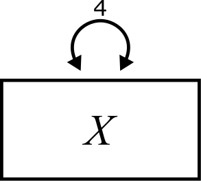

# Variance {#variance}

```{r, echo = FALSE, fig.align= "center"}

```


## A quick refresher on the mean {#variance-mean}

Most of us were taught how to calculate the mean of a variable way back in elementary school: add up all the numbers and divide by the size of the group of numbers. In a statistics context, we often use a "bar" to indicate the mean of a variable; in other words, if a variable is called $X$, the mean is denoted $\overline{X}$. Remembering that we always use $n$ to represent the sample size, the formula is

$$
\overline{X} = \frac{\sum{X}}{n}
$$

(In case you forgot, the Greek letter Sigma $\Sigma$ stands for "sum" and means "add up all values of the thing that follows".)

::: {.rmdnote}

Here is a small data set we'll use throughout this chapter as a simple example we can work "by hand":

3, 4, 5, 6, 6, 7, 8, 9

Calculate the mean of this set of eight numbers.

:::


## Calculating variance {#variance-calculating}

Variance is a quantity meant to capture information about how spread out data is.

Let's build it up step by step.

The first thing to note about spread is that we don't care how large or small the numbers are in any absolute sense. We only care how large or small they are *relative to each other*.

::: {.rmdnote}

Look at the numbers from the earlier exercise:

3, 4, 5, 6, 6, 7, 8, 9

What if we had the following numbers instead?

1003, 1004, 1005, 1006, 1006, 1007, 1008, 1009

Explain why any reasonable measure of "spread" should be the same for both groups of numbers.

:::

One way to measure how large or small a number is relative to the whole set is to measure the distance of each number to the mean.

::: {.rmdnote}

Recall that the mean of the following numbers is 6:

3, 4, 5, 6, 6, 7, 8, 9

Create a new list of eight numbers that measures the distance between each of the above numbers and the mean. In other words, subtract 6 from each of the above numbers.

Some of the numbers in your new list should be negative, some should be zero, and some should be positive. Why does that make sense? In other words, what does it mean when a number is negative, zero, or positive? 

:::

If the original set of numbers is called $X$, then what you've just calculated is a new list $\left(X - \overline{X}\right)$. Let's start organizing this into a table:

| $X$ | $\left(X - \overline{X}\right)$ |
|-----|---------------------------------|
| 3   | -3                              |
| 4   | -2                              |
| 5   | -1                              |
| 6   |  0                              |
| 6   |  0                              |
| 7   |  1                              |
| 8   |  2                              |
| 9   |  3                              |

The numbers in the second columns are "deviations" from the mean.

::: {.rmdnote}

One way you might measure "spread" is to look at the average deviation. After all, if the deviations represent the distances to the mean, a set with large spread will have large deviations and a set with small spread will have small deviations.

Go ahead and take the average (mean) of the numbers in the second column above.

Uh, oh! You should have calculated zero. Explain why you will always get zero, no matter what set of numbers you start with.

:::

The idea of the "average deviation" seems like it should work, but it clearly doesn't. How do we fix the idea?

Hopefully, you identified that having negative deviations was a problem because they canceled out the positive deviations. But if all the deviations were positive, that wouldn't be an issue any more.

There are two ways of making numbers positive:

-   Taking absolute values

We could just take the absolute value and make all the values positive. There are some statistical procures that do just that,^[This leads to the "mean absolute deviation" or MAD.] but we're going to take a slightly different approach...

- Squaring

If we square each value, they all become positive.

Taking the absolute value is conceptually easier, but there are some historical and mathematical reasons why squaring is a little better.^[If you know calculus, you might think why the square function is much better behaved than the absolute value function.]


::: {.rmdnote}

Square each of the numbers from the second column of the table above. This will calculate a new list $\left(X - \overline{X}\right)^{2}$

:::

Putting the new numbers into our previous table:

| $X$ | $\left(X - \overline{X}\right)$ | $\left(X - \overline{X}\right)^{2}$ |
|---|----|---|
| 3 | -3 | 9 |
| 4 | -2 | 4 |
| 5 | -1 | 1 |
| 6 |  0 | 0 |
| 6 |  0 | 0 |
| 7 |  1 | 1 |
| 8 |  2 | 4 |
| 9 |  3 | 9 |

::: {.rmdnote}

Now take the average (mean) of the numbers in the third column above.

:::

The number you got (should be 3.5) is *almost* what we call the variance. There's only one more annoying wrinkle.

When you took the mean of the last column of numbers, you added them all up and divided by 8 since there are 8 numbers in the list. But for some fairly technical mathematical reasons, we actually don't want to divide by 8. Instead, we divide by one less than that number; in other words, we divide by 7.^[For more information on that, search the internet for "sample variance unbiased"]

::: {.rmdnote}

Re-do the math above, but divide by 7 instead of dividing by 8.

:::

The number you found is the *variance*, written as $Var(X)$. The full formula is

$$
Var(X) = \frac{\sum{\left(X - \overline{X}\right)^{2}}}{n - 1}
$$

As a one-liner, the formula may look a little intimidating, but when you break it down step by step as we did above, it's not so bad.

Here is the full calculation in the table:

| $X$ | $\left(X - \overline{X}\right)$ | $\left(X - \overline{X}\right)^{2}$ |
|---|----|---|
| 3 | -3 | 9 |
| 4 | -2 | 4 |
| 5 | -1 | 1 |
| 6 |  0 | 0 |
| 6 |  0 | 0 |
| 7 |  1 | 1 |
| 8 |  2 | 4 |
| 9 |  3 | 9 |
|   |    | Sum: 28  |
|   |    | Variance: 28/7 = $\boxed{4}$ |


In our diagrams, the variance of a variable is indicated by a curved, double-headed arrow, labeled with the value of the variance, like this:

```{r, echo = FALSE, fig.align= "center"}

```


::: {.rmdnote}

Using the tabular approach, calculate the variance of the following set of numbers:

4, 3, 7, 2, 9, 4, 6

:::

::: {.rmdnote}

Consider the following two sets of numbers:

A) 1, 2, 5, 8, 9

B) 1, 4, 5, 6, 9

Without doing any calculations, which of the sets has the larger variance?

Once you've decided, then calculate the variance for both sets and check your answer.

:::


## Calculating variance in R {#variance-r}

Once we've done it by hand a few times to make sure we understand how the formula works, from here on out we can let R do the work for us:

```{r}
X1 <- c(3, 4, 5, 6, 6, 7, 8, 9)
var(X1)
```

```{r}
X2 <- c(4, 3, 7, 2, 9, 4, 6)
var(X2)
```

```{r}
X3 <- c(1, 2, 5, 8, 9)
var(X3)
```

```{r}
X4 <- c(1, 4, 5, 6, 9)
var(X4)
```

This is also easier for real-world data that is not highly engineered 😉 to produce whole numbers:

```{r}
PlantGrowth$weight
```

```{r}
var(PlantGrowth$weight)
```


## Variance rules {#variance-rules}

In this course, we will need to be able to calculate the variance of various combinations of variables. For example, if $X_{1}$ and $X_{2}$ are two variables, we can create a new variable $X_{1} + X_{2}$ by adding up the values of the two variables. What is the variance of $X_{1} + X_{2}$?

But before we answer that, let's establish the first rule.

::: {.rmdimportant}

-  <a id = "Rule1">**Rule 1**</a>

Suppose that $C$ is a "constant" variable, meaning that it always has the same value (rather than being a variable that could contain lots of different numbers). Then,

$$
Var\left(C\right) = 0
$$
:::

::: {.rmdnote}

Why is [**Rule 1**](#Rule1) true? You can either reason through this conceptually, based on how you understand what variance is supposed to measure, or you can do a sample calculation. (Make a table starting with a column that contains many copies of only a single number and work through the calculation.)

:::

Now, back to the example at the beginning of the section of finding the variance of $X_{1} + X_{2}$.

::: {.rmdimportant}

-  <a id = "Rule2">**Rule 2**</a>

If $X_{1}$ and $X_{2}$ are independent, then

$$
Var\left(X_{1} + X_{2}\right) =
Var\left(X_{1}\right) + Var\left(X_{2}\right)
$$

:::

We're not going to get into a formal definition of *independence* here. For now, it suffices to think of the intuitive definition you may already have in your head of what it means for two things to be independent. The idea is that, to be independent, $X_{1}$ and $X_{2}$ should have nothing to do with each other. Knowing the values of one should not give you any information about values of the other. In the next chapter [LINK], we'll say more about this rule.

It's important to note that [**Rule 2**](#Rule2) is an abstract mathematical rule that holds *in theory*. When we have actual data, however, we know that statistics won't always match their theoretical values. For example, even if a true population mean is 42, samples drawn from that population will have sample means that are *close* to 42, but likely not exactly 42.^[The exact distribution of sample means around a true population value is something you probably learned about in an intro stats course. Sample means follow a Student t distribution.]

::: {.rmdnote}

Let's test this out. Below are two new variables that are defined using random numbers. The first one is normally distributed with mean 1 and standard deviation 2.  The second one is normally distributed with mean 4 and standard deviation 3. [WHERE DOES SEED INFO GO?] These are independent because the definition of $X_{5}$ does not depend on any way on the definition of $X_{6}$ and vice versa.

The sample sizes (2000) are large enough that we should get pretty close to the theoretically correct results here.

```{r}
set.seed(10101)
X5 <- rnorm(2000, mean = 1, sd = 2)
X6 <- rnorm(2000, mean = 4, sd = 3)
```

```{r}
head(X5)
```

```{r}
head(X6)
```

Use R to calculate the variance of $X_{5}$ and $X_{6}$ separately. Then use R to add the two numbers you just obtained (the sum of the two variances). Finally, use R to calculate the variance of the sum of the two variables.

:::

Here's an example to help think about this intuitively.

Suppose someone comes along and offers to give you a random amount of money, some number between \$0 and \$100.^[To be more concrete, the values are uniformly distributed, meaning that any number between 0 and 100 is equally likely.] If the variance is a measure of spread, then it stands to reason that variance reflects something about how uncertain you are about how much money you will have after this transaction. On average, you expect about $50, but you know that the actual amount of money you will receive can vary greatly.

Okay, now a second person comes along and offers you the same deal, a random dollar gift between \$0 and \$100.^[Apparently you live in a town with very generous strangers.] At the end of both transactions, how much money will you have? On average, maybe about \$100, but what about your uncertainty? Because the total amount is the result of two random gifts, you are even less sure how close to \$100 you might be. The range of possible values is now \$0 to \$200.^[To be clear, though, the probabilities are no longer uniform between 0 and 200. To get near 0, you would have to be unlucky twice, and to get near 200 you would have to get lucky twice.] Your uncertainty is greater overall.

Of course, all this explains is why the variance of the sum of two variables is larger than the variance of either variable individually. The fact that the variance of the sum of two independent variables is *exactly* the sum of the variances has to be shown mathematically. But hopefully, the intuition is clear.

The next rule is a consequence of the first two rules, so we will not give it a special number

::: {.rmdimportant}

$$
Var\left(X + C\right) = Var\left(X\right)
$$
:::

::: {.rmdnote}

Can you apply [**Rule 2**](#Rule2) followed by [**Rule 1**](#Rule1) to see mathematically why $Var\left(X + C\right) = Var\left(X\right)$?

:::

::: {.rmdnote}

What is the intuition behind the statement $Var\left(X + C\right) = Var\left(X\right)$? In other words, can you explain the rule to someone in terms of what it means about shifting the values of a data set up or down by a constant amount?

:::

[**Rule 3**](#Rule3) is similar to [**Rule 2**](#Rule2), but it's quite counter-intuitive:

::: {.rmdimportant}

-  <a id = "Rule3">**Rule 3**</a>

If $X_{1}$ and $X_{2}$ are independent, then

$$
Var\left(X_{1} - X_{2}\right) =
Var\left(X_{1}\right) + Var\left(X_{2}\right)
$$

:::

It is very common for students to think that a minus sign on the left would translate into a minus sign on the right.^[This results from many years of developing a Pavlovian response to anything that looks like the distributive law from algebra.]

What gives?

Let's return to our example of strangers giving you money.^[Actually, that sounds a little creepy when put like that.] The first person still offers you a random amount between \$0 and \$100. But, now, the second person is a robber, and forces you to give them a random dollar value between \$0 and \$100 (of their choosing, of course). How much money do you expect to have after these two events? On average, \$0. (The first person gives you, on average, \$50, and the second person takes away, on average, \$50.) But how certain are you about that amount?

Imagine a world in which the wrong rule prevailed. What if $Var\left(X_{1} - X_{2}\right)$ were truly the difference of the two variances. But $Var\left(X_{1}\right)$ and $Var\left(X_{2}\right)$ are the same in this scenario. (Although one person is giving money and one is taking, our uncertainty about the dollar amount is the same in both cases.) And this implies
$$
Var\left(X_{1}\right) - Var\left(X_{2}\right) = 0
$$
Can this be true? Zero variance means "no spread" which means exact certainty of the value. (Remember [**Rule 1**](#Rule1)?) Are you 100% confident that you will end both transactions with exactly \$0? No way!

In fact, the amount of money you end up with ranges from -\$100 up to \$100. This is a larger range than in either transaction individually. Our uncertainty has grown because there are two random processes in play, just like in the scenario with two beneficent strangers. In fact, the width of the range of possibilities is the same in both scenarios: \$0 to \$200 and -\$100 to \$100 both span a range of $200.

The next rule, unfortunately, does not have a great intuitive explanation. It will make a little more sense in the next chapter [LINK], and we'll revisit it then.

::: {.rmdimportant}

-  <a id = "Rule4">**Rule 4**</a>

If $a$ is any number, 

$$
Var\left(aX\right) = a^2 Var\left(X\right)
$$

:::

If you go back to the table, imagine multiplying every number in the first column by $a$. Every number in the second column will still have a factor of $a$. But when you square those values, every number in the third column will have a factor of $a^{2}$. That's the gist of the rule anyway. But, again, there's not much intuition about why that makes sense.

::: {.rmdnote}

We can, at least, check empirically that the rule works.

We'll use $X_{5}$ as we defined it above, a normally distributed variable with mean 1 and standard deviation 2. The variance of the data is about 4:

```{r}
var(X5)
```

Let's use $a = 3$.

In R, calculate $Var\left(3X_{5}\right)$. (Don't forget that in R, you can't just type `3 X5`. You have to explicitly include the multiplication sign: `3 * X5`.)

Now try calculating $3 Var\left(X_{5}\right)$. You'll see that you don't get the right answer.

But now try $9 Var\left(X_{5}\right)$. That should work.

:::


And that's all the variance rules we'll need!


## Standard deviation {#variance-sd}

The variance is nice because it obeys all the above rules. The one big downside is that it's not very interpretable.

For example, think of the scenario with people giving/taking money. In that case, the values were measures in units of dollars.

::: {.rmdnote}

If $X$ is measured in dollars, what are the units of measurement of $\overline{X}$? That seems sensible, right?

What are the units of $\left(X - \overline{X}\right)$? Still sensible, right? (It's not a problem that some of these values will be positive and other negative. Negative dollars still make sense. Just think about your student loans.)

Okay, now here's where things get weird. What are the units of $\left(X - \overline{X}\right)^{2}$? This no longer makes sense.

:::

Variance is *nearly* the average of a bunch of squared deviations, so for a variable measured in dollars, the units of variance would be "squared dollars", whatever that is.

Variances are not really interpretable directly. How do we make them more interpretable? Well, if variance has "squared" units, we can take the square root to get back to the natural units we started with.

And this is called the standard deviation, $SD(X)$.

$$
SD(X) = \sqrt{\frac{\sum{\left(X - \overline{X}\right)^{2}}}
{n - 1}}
$$

Due to its interpretability, an intro stats class will focus far more on the standard deviation than on the variance. The downside is that the mathematical rules aren't so nice for standard deviations. For example, what is
$$
SD\left(X_{1} + X_{2}\right)?
$$

You can work through the definition to see that

$$
SD\left(X_{1} + X_{2}\right) = \sqrt{
SD\left(X_{1}\right)^{2} + SD\left(X_{2}\right)^{2}
}
$$
But, eww, that's gross.

For SEM, we will focus almost exclusively on variance and switch to standard deviation for only two reasons:

1. We need to communicate something about spread in meaningful units.
2. We need to standardize variables. (See Section \@ref(variance-standardizing) below.)


## Mean centering data {#variance-mean-centering}

Many of the statistical techniques taught in an intro stats course focus on learning about the means of variables. Structural equation modeling is a little different in that it is more focused on the explaining the variability of data---how changes in one or more variables predict changes in other variables.^[There are tools in SEM for working with means as well. WILL WE COVER THIS IN A FUTURE CHAPTER?]

A habit we'll start forming now is to mean center all our variables. We do this by subtracting the mean of a variable from all its values.

::: {.rmdnote}

Let's use $X_{6}$ as we defined it before, a normally distributed variable with mean 4 and standard deviation 3. How do we interpret the values of $X_{6} - \overline{X_{6}}$? (Remember, this is just the second column in our variance tables earlier.)

If we shift all the $X_{6}$ values to the left by $\overline{X_{6}}$ units, what is the mean of the new list of numbers?

Let's verify this in R. We'll use the "suffix" `mc` to indicate a mean-centered variable.

```{r}
X6_mc <- X6 - mean(X6)
mean(X6_mc)
```
Why does this answer not exactly agree with the "theoretical" answer you came up with in a few lines above? (If you don't already know, the `e-16` in the expression above is scientific notation and means "times $10^{-16}$. That's a really small number!)

Take a guess about the variance of `X6_mc`. Verify your guess in R.

:::

So the good news is that **mean centering preserves the variance**. While the mean will be shifted to be 0, the variance does not change, so any statistical model we build that analyzes the variance will not be affecting by mean-centering.


## Standardizing data {#variance-standardizing}

After we've mean centered the data, we can go one step further and divide by the standard deviation. This results in something often called a *z-score*. The process of converting variables from their original units to z-scores is called *standardizing* the data.

$$
Z = \frac{\left(X - \overline{X}\right)}{SD(X)}
$$

Why is this useful? One reason is that it remove the units of measurement to facilitate comparisons between variables. Suppose $X$ represents height in inches. The numerator ($X - \overline{X}$) has units of inches. The standard deviation $SD(X)$ also has units of inches. So when you divide, the units go away and the z-score is left without units, sometimes called a "dimensionless quantity".

::: {.rmdnote}

Suppose a female in the United States is 6 feet tall (72 inches). Suppose a female in China is 5'8 tall (68 inches). In absolute terms, the American woman is taller than the Chinese woman. But what if we're interested in knowing which woman is taller *relative* to their respective population?

The mean height for an American woman is 65" with a standard deviation of 3.5" The mean height for a Chinese woman is 62" with a standard deviation of 2.5". (These numbers aren't perfectly correct, but they're probably close-ish.)

Calculate the z-scores for both these women.

Which woman is taller relative to their population?

:::

Although z-scores don't technically have units, we can think of them as measuring how many standard deviations a value lies above or below the mean.

::: {.rmdnote}

What is the z-score for a value that equals the mean?

What is the meaning of a negative z-score?

:::

The z-score for the American woman was 2. This means that her height measures two standard deviations above the mean.

For real-world data, we will use technology to do this. Here are some temperature measurements from New York in 1974. (These are daily highs across a six-month period.)

```{r}
airquality$Temp
```

We calculate the mean and standard deviation:

```{r}
mean(airquality$Temp)
```

```{r}
sd(airquality$Temp)
```

This is an average high of about 78 degrees Fahrenheit with a standard deviation of about 9.5 degrees Fahrenheit.

If we just subtract the mean, we get mean-centered data.

```{r}
airquality$Temp - mean(airquality$Temp)
```

But if we also divide by the standard deviation, we get a standardized variable (or a set of z-scores). Note the extra parentheses to make sure we get the order of operations right. We have to subtract first, but then divide that whole mean-centered quantity by the standard deviation.

```{r}
(airquality$Temp - mean(airquality$Temp))/sd(airquality$Temp)
```

The easier way to do this in R is to use the `scale` command:

```{r}
scale(airquality$Temp)
```

Although the outputs are formatted a little differently, you can go back and check that these sets of numbers match each other.

::: {.rmdnote}

What is the mean of a standardized variable? How do you know this?

:::

::: {.rmdnote}

Let's calculate the variance of a standardized variable. To do so, I'll note that the mean $\overline{X}$ is just a number. Also, the standard deviation $SD(X)$ is just a number. To make the calculation easier to understand, let's just substitute letters that are easier to work with:

$M = \overline{X}$

$S = SD(X)$.

Remember, $M$ and $S$ are *constants*.

Now we need to calculate $Var(Z)$. I'll do the first couple of steps. Then you take over and, using the variance rules from earlier in the chapter, simplify the expression until you get to a numerical answer.

\begin{align}
Var(Z) &= Var\left(\frac{\left(X - \overline{X}\right)}{SD(X)}\right) \\
    &= Var\left(\frac{\left(X - M\right)}{S}\right) \\
    &= Var\left(\frac{1}{S}\left(X - M\right)\right) \\
    &= \quad ???
\end{align}

:::

You should get the answer 1. A standardized variable always has variance 1. This will be an important fact in future chapters.


