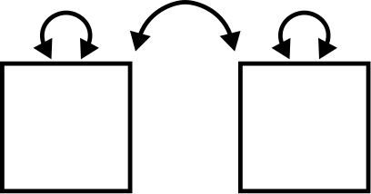
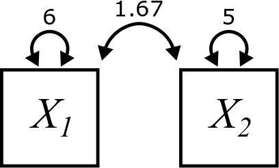

# Covariance {#covariance}

```{r, echo = FALSE, fig.align= "center"}

```


## Calculating covariance {#covariance-calculating}

The last chapter was about variance, which measures the spread of a single variable. Now we extend this idea to pairs of variables.

We say that two variables "co-vary" when the spread of one variable is related to the spread of another variable. This relationship represents an *association* between the two variables.

We'll call our two variables $X_{1}$ and $X_{2}$. To keep things simple, let's assume that we have already mean centered our variables.

::: {.rmdnote}

If $X_{1}$ and $X_{2}$ are already mean centered, then what are $\overline{X_{1}}$ and $\overline{X_{2}}$?

:::

As we did in the last chapter with variance, we'll build up the calculation of covariance step-by-step using a table to keep track of intermediate quantities we need.

Here are two variables (with $n = 7$) that have been mean centered:

| $X_{1}$ | $X_{2}$ |
|---------|---------|
| -1      | -2      |
| -2      |  2      |
|  2      | -2      |
| -3      | -1      |
|  4      |  2      |
| -1      | -2      |
|  1      |  3      |

::: {.rmdnote}

Check that the mean of both columns is truly zero.

:::

Something interesting happens when we look at the product $X_{1}X_{2}$.

::: {.rmdnote}

If $X_{1}$ and $X_{2}$ both lie above their means, they are both positive numbers. Therefore, their product is positive.

What if both $X_{1}$ and $X_{2}$ lie below their means? What do we know about their values individually and what do we know about their product?

:::

Here is the chart again, but with the products listed in a new column:

| $X_{1}$ | $X_{2}$ | $X_{1}X_{2}$ |
|---------|---------|--------------|
| -1      | -2      |  2           |
| -2      |  2      | -4           |
|  2      | -2      | -4           |
| -3      | -1      |  3           |
|  4      |  2      |  8           |
| -1      | -2      |  2           |
|  1      |  3      |  3           |

Now we add up the products across all seven data pairs:

| $X_{1}$ | $X_{2}$ | $X_{1}X_{2}$ |
|---------|---------|--------------|
| -1      | -2      |  2           |
| -2      |  2      | -4           |
|  2      | -2      | -4           |
| -3      | -1      |  3           |
|  4      |  2      |  8           |
| -1      | -2      |  2           |
|  1      |  3      |  3           |
|         |         | Sum: 10      |


So when $X_{1}$ and $X_{2}$ tend to have similar values (both positive or both negative), their product is usually positive. It's not true of every pair of values in the table above; some products are negative. But the majority are positive. Therefore, the sum of all such products will be positive.

We're almost there. Just like we wanted the average squared deviation to calculate the variance, here we want the average of the products from the third column above. And just like in the case of variance, it's not *quite* the average we calculate. Instead of dividing by $n$, we divide by $n - 1$ for exactly the same esoteric reason.

Putting this all together:

| $X_{1}$ | $X_{2}$ | $X_{1}X_{2}$ |
|---------|---------|--------------|
| -1      | -2      |  2           |
| -2      |  2      | -4           |
|  2      | -2      | -4           |
| -3      | -1      |  3           |
|  4      |  2      |  8           |
| -1      | -2      |  2           |
|  1      |  3      |  3           |
|         |         | Sum: 10      |
|         |         | Covariance: 10/6 = $\boxed{1.67}$ |

In our diagrams, the covariance of two variables is indicated by a curved, double-headed arrow pointing at both boxes and labeled with the value of the covariance, like this:

```{r, echo = FALSE, fig.align= "center"}

```

::: {.rmdnote}

Suppose $X_{1}$ tends to be positive when $X_{2}$ is negative and $X_{1}$ tends to be negative when $X_{2}$ is positive. What will the product $X_{1}X_{2}$ usually be? Therefore, what will the sum of all such products likely be?

:::

Here is the final formula for covariance, written as $Cov\left(X_{1}, X_{2}\right)$. This works for all pairs of variables, even if they aren't mean centered. The terms $\left(X_{1} - \overline{X_1}\right)$ and $\left(X_{2} - \overline{X_2}\right)$ do the mean centering:

$$
Cov\left(X_{1}, X_{2}\right) = \frac{\sum \left(X_{1} - \overline{X_{1}}\right)\left(X_{2} - \overline{X_{2}}\right)}{n - 1}
$$

For general variables (not necessarily mean centered), the table will actually look like this:

|$X_{1}$| $X_{2}$|$\left(X_{1} - \overline{X_{1}}\right)$ | $\left(X_{2} - \overline{X_{2}}\right)$ | $\left(X_{1} - \overline{X_{1}}\right)\left(X_{2} - \overline{X_{2}}\right)$ |
|-----|-----|-----|-----|-----|
| 4   | 3   | -2  | 1   | -2  |
| ... | ... | ... | ... | ... |


::: {.rmdnote}

Calculate the covariance by hand by making a table like the one above. (These variables are *not* mean centered, so you'll have to calculate the mean of each variable in order to fill out the third and fourth columns.)

$X_{1}: 8, 10, 16, 7, 4, 3$

$X_{2}: 6, 5, 4, 9, 11, 7$

Explain intuitively why the covariance is negative.

:::


::: {.rmdnote}

When calculating variance, the order of the data points does not matter. Why?

When calculating covariance, the order of the data points *does* matter. Why?

What if you keep pairs together, but rearrange the rows of the table. How does that affect the covariance?

:::


## Calculating covariance in R {#covariance-r}

## Covariance rules {#covariance-rules}
