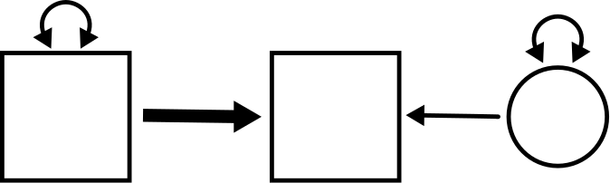

# Simple regression {#simple}

```{r, echo = FALSE, fig.align= "center"}

```


## Preliminaries {-}

We need to load the packages we will need for this chapter. The `tidyverse` package has all sorts of utilities for working with tibbles (data frames). This will also be our first introduction to the `lavaan` package that will be used throughout the rest of the book.

```{r}
library(tidyverse)
library(lavaan)
```


## Prediction {#simple-prediction}

One of the most important tasks in statistics is *prediction*. Given some data, can we predict the value of something important about a population of interest?

::: {.rmdnote}

Suppose you have gathered some data on anxiety among Utah high school students. There are various instruments available for measuring anxiety, so say you have administered the [Beck Anxiety Inventory](https://en.wikipedia.org/wiki/Beck_Anxiety_Inventory). This instrument assigns a score from 0 to 63, with lower numbers indicating less anxiety and higher numbers indicating more.

You take care to make sure your sample is as close to a simple random sample as possible so that it's representative of the population (all high school students in the state of Utah). From your sample data, you can calculate summary statistics. For example, you might find that the mean anxiety score for Utah high school students is 7.1 with a standard deviation of 3.9.

A random Utah high school student walks through the door. You don't know anything about them. Can you say anything about their anxiety? What is your best guess as to what their score might be on the Beck Anxiety Inventory?

:::

We can do a lot better if we have another variable we can measure. For example, let's suppose our data records not only anxiety, but also the minutes of smart phone usage per day.

::: {.rmdnote}

In theory, why would having information about smart phone usage potentially help us make better predictions of anxiety?

Do you suspect that the association between anxiety and smart phone usage is positive or negative? (You can Google this question to check if there is any empirical evidence out there for your guess.)

:::

::: {.rmdnote}

Now imagine that another random Utah high school student walks through the door. This time, I tell you that their smart phone usage is average (sitting at the mean). What is your best prediction for their anxiety score? (Give an exact value.)

What if I told you that the student who walked through the door had *higher* than average smart phone usage? What would be your prediction of their anxiety score? (You can't give an exact value here, but give a qualitatively sensible answer.)

What if I told you that the student who walked through the door had *lower* than average smart phone usage? What would be your prediction of their anxiety score? (Again, just give a qualitatively sensible answer.)

:::


## Regression terminology  {#simple-terminology}

When we have one variable we suspect may help us predict another variable, one way to study it is using a simple regression model.

This is related to, but somewhat different from, covariance. Covariance is symmetric, so it expresses the idea that two variables are mutually related. But there is no "directionality" to that relationship. By way of contrast, a simple regression model asserts that one of the variables is "explanatory" and the other is "response". In other words, we start with the values or properties of the explanatory variable and try to deduce what we can about the values or properties of the response variable.

Keep in mind that "directionality" is not the same as "causality". While it's possible that one variable causes another, there needs to be a data collection process (often a carefully controlled experiment) and a clear scientific rationale that justifies a causal relationship between variables before we can start thinking about inferring causality. For purposes of much of this book, directionality just means that we wish to establish a predictive relationship wherein we start with the properties of one variable and try to predict the properties of another variable. There is often a "sensible" order in which to do this based on the research questions asked or the hypotheses posed. 

There are many different terminological conventions in statistics, so be aware that "explanatory" variables are also called---often depending on the discipline and the context---predictors, features, covariates, controls, regressors, inputs, or independent variables. In fact, in the context of structural equation modeling, we will use the term "exogenous" to refer to variables that play this role. (That term has a much more precise definition that we'll discuss in future chapters.) And "response" variables might be called outcomes, outputs, targets, explained variables, or dependent variables, among others. In this book, we will often use the term "endogenous" (again, in a very specific way yet to be explained). If there is a data collection process and a clear scientific rationale that justifies a causal relationship between variables, then we might be able to refer to variables as either "cause" or "effect".

Keep in mind that it's the scientific question we want to ask that determines the explanatory/response relationship. A different researcher with a different hypothesis might use the same two variables but with the roles reversed.

::: {.rmdnote}

In the anxiety/smart-phone example above, which variable is explanatory and which is response, at least according to the way we stated the scenario?

:::


## The simple regression model {#simple-model}

Here is the figure from the top of the chapter, only now we have decorated it with some letters (and a number):

```{r, echo = FALSE, fig.align= "center"}
knitr::include_graphics("graphics/simple_regression_params.png")
```

The goal of this section is to explain all these.

The variable names are $X$ and $Y$. $X$ is the exogenous variable and $Y$ is the endogenous variable. For example, $X$ might be smart phone usage and $Y$ might be the anxiety score from the example above. In this section, we're going to do some concrete calculations using the example from the last chapter about wind speed and temperature from the `airquality` data set. In the last chapter, we simply calculated the (symmetric) correlation between wind speed and temperature. Here, we will consider wind speed as exogenous and temperature as endogenous. In other words, our goal is to use the wind speed as a predictor of temperature.

The letter $v$ requires no further explanation. This is the variance of the variable $X$, so we already know about it.

The parameter $b$ is supposed to measure something about the predictive relationship between $X$ and $Y$. It is attached to an arrow that is drawn a little thicker than the other arrows in the diagram. More to say about that in a moment.

The really weird, new part is the circle on the right. This will be the "error" term.

What is "error" and why is it here? To illustrate, let's plot wind speed against temperature. Before plotting and analyzing these variables, we are going to mean-center them and put them in a tibble.

```{r}
X <- airquality$Wind - mean(airquality$Wind)
Y <- airquality$Temp - mean(airquality$Temp)
airquality_mc <- tibble(X, Y)
airquality_mc
```

```{r}
ggplot(airquality_mc, aes(y = Y, x = X)) +
    geom_point()
```

Note that the exogenous variable (wind speed) is on the x-axis and the endogenous variable (temperature) is on the y-axis.

We can see a negative and reasonably linear association between these variables, so let's add a line of best fit to the data.

```{r}
ggplot(airquality_mc, aes(y = Y, x = X)) +
    geom_point() +
    geom_smooth(method = lm, se = FALSE)
```


::: {.rmdnote}

The line passes right through the origin $(0, 0)$. Why?

:::

The slope of this line is $-1.23$. We'll see how to calculate this slope in a bit. But what does this slope mean?

::: {.rmdnote}

Look at the help file for the `airquality` data set. (Either use the Help tab in RStudio or type `?airquality` at the Console.)

What are the units of measurement of $X$? What are the units of measurement of $Y$? Since slope is "rise over run", what are the units of the slope?

:::

So, the idea is that for every additional mile per hour of wind speed, we predict that the temperature goes down by 1.23 degrees Fahrenheit.

::: {.rmdnote}

Why is the following sentence incorrect?

> For every additional mile per hour of wind speed, the temperature goes down by 1.23 degrees Fahrenheit.

:::

The point is that the line is a *model* that makes predictions. As long as $X$ and $Y$ are both mean-centered, the equation of this line is

$$
\hat{Y} = bX
$$

There is a new piece of notation here: $\hat{Y}$. This symbol represents the *predicted* value of $Y$ according to the model. We will not get the *actual* value of $Y$ from this piece of the model because the actual values of $Y$ differ from the model because real-world data doesn't lie on a perfect straight line. More on that in a moment.

According to the information above, we can estimate that the value of $b$ is $-1.23$:

$$
\hat{Y} = -1.23X
$$

This is a multiplicative effect. Again, as long as $X$ and $Y$ are both mean-centered, knowing the value of $X$ allows us to predict the value of $Y$ by multiplying by $b$.

But those predictions will almost always be wrong. On any given day, given an increase of 1 mile per hour wind in wind speed, it will very rarely happen that the temperature will drop by *exactly* 1.23 degrees. That's just a sort of "average" over time. On average, there's a slight temperature change associated with 1 mph change in wind speed, and the number -1.23 is the best estimate of that average change across our whole data set. We need to be *especially* clear that an increase in wind speed does not necessary *cause* a drop in temperature. I mean, that might be partially true, but we can't prove it from our observational data. There are all sorts of other reasons to explain both an increase in wind speed and a drop in temperature (like a cold front moving in).

Since our predictions are average effects and not specific guarantees, every prediction we make will be wrong by some amount. (We could get extremely lucky, but even then, it's difficult to imagine a situation in which our prediction is precisely correct to, say, 10 decimal places or something like that.) Therefore, there is error in our prediction. The new equation---accounting for error---is

$$
Y = bX + E
$$
or
$$
Y = -1.23X + E
$$

Now we use $Y$ instead of $\hat{Y}$. Once we include the error, we can recover the exact value of $Y$, so this is no longer just a prediction from the straight-line model. Remember this:

::: {.rmdimportant}

If you write down a regression equation for an endogenous variable that includes all incoming arrows, *including the residual error term*, use $Y$.

If you write down a regression equation for an endogenous variable that includes all incoming arrows, *excluding the residual error term*, use $\hat{Y}$.

:::

Error is a funny word because it has a negative connotation. It sounds like we made a mistake. Well, the model does make mistakes. Every model prediction is technically wrong. But this is not the kind of mistake that results from doing our arithmetic wrong or anything like that. It's simply the "natural" error that results from the messiness of the real world and the impossibility of predicting anything with certainty. For this reason, we will often prefer the term "residual". It's what is "left over" after we have made a prediction. It's the extra change in temperature, for example, that is not accounted for by the model with wind speed alone.

The residuals are evident in the plot above. If there were no residuals, every data point would lie on a perfect straight line. But the data points are all either a little above or below the line. Those vertical distances between the data and the line are the residuals or errors. Here is an example of two residuals plotted below in red.

```{r}
ggplot(airquality_mc, aes(y = Y, x = X)) +
    geom_point() +
    geom_smooth(method = lm, se = FALSE) +
    annotate("segment",
             x = -2.56, y = 3.15,
             xend = -2.56, yend = 3.15 - 14.03,
             color = "red", size = 1.5) +
    annotate("segment",
             x = 4.94, y = -6.08,
             xend = 4.94, yend = -6.08 + 9.20,
             color = "red", size = 1.5)
```

Points below the line have negative residuals and points above the line have positive residuals.

The residuals do not appear as observed or measured variables in our data. They are a consequence of a variety of *unmeasured* factors that determine temperature aside from wind speed. An unmeasured variable that appears in a model is called a *latent variable*. We will discuss latent variables in far greater detail in Chapter \@ref(latent). For now, just know that latent variables are indicated by circles in the diagram. That's why there is a circle with the letter $E$ inside.

::: {.rmdnote}

The equation 

$$
Y = bX + E
$$
can also be written as
$$
Y = bX + 1 \cdot E
$$

How is that "1" represented in the diagram?

:::

The letters $v$, $b$, and $e$ are called *free parameters* because they are free to vary depending on the data. The "1" is called a *fixed parameter*. It is attached to an arrow, so it's technically a parameter of the model, but it is not a parameter that we need to calculate. It is "fixed" at the value 1 because the error term in the model is represented by $+E$ with a fixed coefficient of 1. In general, thoughout the book, if the word "parameter" is used without qualification, you can assume we are talking only about the free parameters, the ones we need to calculate. 

The only thing in the diagram that hasn't been explained yet is $e$.

::: {.rmdnote}

Where does $e$ appear in the diagram? Given where it appears, what does it represent mathematically?

:::

We know that curved arrows represent variance. But what does it mean to measure the variance of a variable we can't observe?

::: {.rmdnote}

What would the scatterplot look like if the error variance were very small. What about if the error variance were large?

:::

There is variability in the size of the residuals. Some are small (points that are close to the line) and some are large (points that are far from the line). This spread of residuals can be estimated from data, just like any other variance calculation.^[We know that variance is close to the average squared deviation, except we divide by $n - 1$ instead of $n$. Well, residuals are a little more weird still. To get an unbiased estimate, you have divide by $n - 2$. However, the calculation that appears next is the one that uses $n - 1$. This is for reasons that, regrettably, we'll have to sweep under the rug here.] It turns out to be about 70.8. We'll see how to calculate that below.

Let's put everything together into a diagram.

::: {.rmdnote}

First, we need the variance of $X$ (wind speed). Calculate it in R. You should get 12.4.

Does it matter if you calculate the variance of the variable `Wind` from the original `airquality` data, or the variance of the $X$ variable from `airqualilty_mc`? Why or why not?

:::

```{r, echo = FALSE, fig.align= "center"}
knitr::include_graphics("graphics/simple_regression_param_values.png")
```


While it's helpful to see $X$ and $Y$ as generic prototypes for any simple regression model, in most applied problems from now on we'll refer to variables using contextually meaningful names. The final diagram looks like this:

```{r, echo = FALSE, fig.align= "center"}
knitr::include_graphics("graphics/simple_regression_param_values_named_vars.png")
```


::: {.rmdnote}

Is the error variable  $E$ exogenous or endogenous?

:::

One final note about this diagram: you may have noticed that the $Y$ variable (or $\textit{TEMP}$) does *not* have a variance term attached. There is no double-headed arrow on that box. Why not? The point here is that we are trying to explain the reasons that $Y$ varies using other elements of the model. In other words, $Y$ has a variance, but that variance is partially explained by $X$. And the rest of the variance not explained by $X$ is explained by the error term $E$. So all the variance is $Y$ is accounted for through the contribution of $X$ and $E$ combined.


## Simple regression assumptions {#simple-assumptions}

All the calculations we need to do, and our ability to interpret the results, depend on certain assumptions being met.

If you look up regression assumptions, you might find a huge list of requirements. Some of these requirements relate to calculating statistics like P-values for regression parameters. For now, we are content simply to know that it makes sense to interpret the parameters in the model above.

For that, we really only need four assumptions:

1. The data should come from a "good" sample.
2. The relationship between $X$ and $Y$ should be approximately linear.
3. The residuals should be independent of the $X$ values.
4. There should be no influential outliers.

Let's address these one at a time:

1. What do we mean by a "good" sample? While a simple random sample is the gold standard, it's usually not possible to obtain one in the real world. So we make our sampling process as random as possible and ensure that the resulting sample is as representative of the population we're trying to study as possible.
2. You can check linearity with a scatterplot. Just make sure the pattern of dots doesn't have strong curvature to it.
3. There should be no patterns in the residuals at all. They should be randomly scattered around the best-fit line and the average size of the residuals should not change radically from one side of the graph to the other.^[This property of similarly-sized residuals is called *homoskesdasticity*. The violation of that condition is called *heteroskedasticity* which is one of Sean's favorite words ever!]
4. Check the scatterplot for outliers. If there are serious ones, assess them to make sure they are not data entry mistakes. If they correspond to valid data, you cannot just throw them away.^[In other words, don't follow the all-too-common "rule of thumb" for outliers, which is just covering them up with your thumb and pretending they don't exist.] Often, the solution is to run the analysis both including and (temporarily) excluding the outliers to make sure their presence doesn't radically alter the parameter estimates.


## Calculating regression parameters {#simple-calculating}

Now we'll show one way to calculate the regression parameters (the numbers) in the above diagram. This isn't the only way to do it. In fact, this is not the approach that is used in most intro stats classes. But this approach will be helpful to illustrate the way we will do these calculations in future chapters.

Let's go back to the diagram without the numbers:

```{r, echo = FALSE, fig.align= "center"}
knitr::include_graphics("graphics/simple_regression_params.png")
```

The letter $v$ is easy because it's just the variance of $X$:

$$
Var(X) = v
$$

We can estimate it directly from the data. (You already did it in R above for the temperature and wind speed data.) Through completing the activities below, we will also calculate $b$ and $e$.

To get the other parameters, we have to set up a few equations. 
The first observation we need to make is that, as important as the arrows are in a diagram, it's just as important where the arrows are *not*.

::: {.rmdnote}

Are there any arrows directly connecting $X$ and $E$? What does that imply about the relationship between $X$ and $E$? Which regression assumption is related to this question?

Given all that, what is $Cov(X, E)$?

:::

Next, because $Y$ is the combination of $X$ and $E$, we've already seen that we can write

$$
Y = bX + E
$$

Therefore, we can calculate $Var(Y)$ according to this formula using the established rules. (A convenient list of all of them in one place is located in Appendix \@ref(appendix-rules).)

::: {.rmdnote}

Keep simplifying the following as much as possible:

\begin{align}
Var(Y)  &= Var(bX + E) \\
        &= \quad ???
\end{align}

You should end up with 

$$
b^{2}v + e
$$

Don't forget that $Var(X) = v$ and $Var(E) = e$ in the diagram!

:::

::: {.rmdnote}

We also need to use information about the covariance between $X$ and $Y$. Keep simplifying the calculation below:

\begin{align}
Cov(X, Y)  &= Cov(X, bX + E) \\
        &= \quad ???
\end{align}

You should end up with

$$
bv
$$

:::

::: {.rmdnote}

Use R to calculate $Var(X)$, $Var(Y)$ and $Cov(X, Y)$.

You should get 12.4, 89.6, and -15.3, respectively.

:::

Now we can set up all the equations we need to solve for the various letters we want. Here are the three equations we have established:

\begin{align}
12.4 &= v \\
89.6 &= b^2v + e \\
-15.3 &= bv
\end{align}

::: {.rmdnote}

Time to do a little algebra. You know $v$. Using that value, solve for $b$ first (using the last equation). Then, using both values of $b$ and $v$, solve for $e$ in the second equation.

Check that the values you got are the same as the ones from the earlier diagram (with the possibility of a little rounding error).

:::

Now let's go through that again, but this time, in full generality:

\begin{align}
Var(X) &= v \\
Var(Y) &= b^2v + e \\
Cov(X, Y) &= bv
\end{align}

Therefore,

::: {.rmdimportant}

$$
v = Var(X)
$$

$$
b = \frac{Cov(X, Y)}{Var(X)}
$$

$$
e = Var(Y) - \left( \frac{Cov(X, Y)}{Var(X)} \right)^2 Var(X)
$$

:::


## The model-implied matrix {#simple-mim}

It will be convenient in future chapters to collect up all these numbers we need in an array of terms called a *sample covariance matrix*. (Sometimes this is called a variance-covariance matrix.) The idea is to take the covariance of all possible pairs of observed variables and arrange them as follows:

$$
\begin{bmatrix}
Cov(X, X)    &    Cov(X, Y) \\
Cov(Y, X)    &    Cov(Y, Y) \\
\end{bmatrix}
$$

There are some immediate simplifications to make.

1. Since $Cov(Y, X) = Cov(X, Y)$, there is no point in writing it twice. We will just use a dot ($\bullet$) to replace $Cov(Y, X)$.
2. We can replace the upper-left and lower-right entries (the entries on the so-called "diagonal" of the matrix) with variances.

This is our final sample covariance matrix:

$$
\begin{bmatrix}
Var(X)       &    Cov(X, Y) \\
\bullet      &    Var(Y)    \\
\end{bmatrix}
$$

With the data we have, we can calculate numbers for all these quantities.

There is another important matrix called the *model-implied matrix*. Given the model, what does the covariance matrix look like? From the calculations above, we know that the model-implied matrix is

$$
\begin{bmatrix}
v         &    bv         \\
\bullet   &    b^{2}v + e \\
\end{bmatrix}
$$

The letters $b$, $v$, and $e$ are unknowns. Okay, $v$ is not *very* unknown. It's an unknown in the sense of being a parameter in the model, but you don't have to work very hard to find it. The point is that model parameters are estimated by equating the covariance matrix (calculated from the data) with model-implied matrix and trying to solve for all the unknown parameters.

There is no new math to do in this section. The matrices are just convenient ways to organize the work we've already done. All parameter estimation in structural equation modeling is essentially setting these two matrices (the sample covariance matrix and the model-implied matrix) equal to each other and attempting to solve for the unknown parameters.

$$
\begin{bmatrix}
Var(X)       &    Cov(X, Y) \\
\bullet      &    Var(Y)    \\
\end{bmatrix} =
\begin{bmatrix}
v         &    bv         \\
\bullet   &    b^{2}v + e \\
\end{bmatrix}
$$

Don't forget that the matrix on the left---the sample covariance matrix---consists of numbers that we calculate from data. The matrix on the right---the model-implied matrix---contains letters, which are the unknown parameters we're trying to find.


## Error variance in terms of correlation {#simple-error-correlation}

The formulas we derived are fine as far as they go. They allow you to take quantities calculated from data (variances and covariances of observed variables) and translate that into estimates of model parameters.

The formula for the error variance $e$ is a little gross, though. With a little trickery, we can simplify that formula quite a bit.

Here is the starting point:

$$
e = Var(Y) - \left( \frac{Cov(X, Y)}{Var(X)} \right)^2 Var(X)
$$

::: {.rmdnote}

Explain why the right-hand side can be rewritten as

$$
Var(Y) - \frac{Cov(X, Y)^{2}}{Var(X)}
$$

:::

We're going to multiply the top and bottom of the fraction on the right by $Var(Y)$:

$$
Var(Y) - \frac{Cov(X, Y)^{2} Var(Y)}{Var(X) Var(Y)}
$$

Then we can factor out a common term of $Var(Y)$ from both pieces:

$$
Var(Y) \left( 1 - \frac{Cov(X, Y)^{2}}{Var(X) Var(Y)} \right)
$$

::: {.rmdnote}

Why would we do such a thing? In other words, does the new fraction on the right look familiar in any way?

:::

We hope you recognize that the fraction on the right is just the correlation coefficient squared. The whole equation can now be written as

::: {.rmdimportant}

$$
e = Var(Y) \left( 1 - r_{XY}^2 \right)
$$

:::

There is a nice consequence of this last equation. The term in parentheses $\left( 1 - r_{XY}^2 \right)$ is a number between 0 and 1, right? Since we are multiplying this by the variance of $Y$, we can think of the term in parentheses as a *proportion*. All the variance of $Y$ is explained in our model in one of two ways. The thick arrow coming in from the left uses $X$ to predict some of the variance of $Y$. All the rest of the variance of $Y$ is left over in the error term $e$. Therefore, $\left( 1 - r_{XY}^2 \right)$ is the proportion of the variance of $Y$ left over as error.

And if that is true, it must also be the case that $r_{XY}^2$ is the proportion of the variance of $Y$ explained by $X$. Calculating one minus a proportion gives the complementary proportion. For example, if $\left( 1 - r_{XY}^2 \right) = 0.3$, then 30% of the variance of $Y$ is left over as error. But that implies that 70% of the variance of $Y$ is explained by $X$. $1 - 0.3 = 0.7$.

Most authors will write $R^{2}$ instead of $r^{2}$ for some reason.


## Regression with standardized variables {#simple-standardized}

Recall that if we convert our variables to z-scores, variances are all 1 and covariances become correlation coefficients. In other words, the covariance matrix becomes a *correlation matrix* and looks like this:

$$
\begin{bmatrix}
1       &    r_{XY} \\
\bullet &    1      \\
\end{bmatrix}
$$

The model-implied matrix does not change. Solving for the parameters as before is the same, then, except we can now replace $Var(X)$ and $Var(Y)$ with 1, and $Cov(X, Y)$ with $r_{XY}$.

$$
\begin{bmatrix}
1       &    r_{XY}  \\
\bullet      &    1  \\
\end{bmatrix} =
\begin{bmatrix}
v         &    bv         \\
\bullet   &    b^{2}v + e \\
\end{bmatrix}
$$

\begin{align}
1 &= v \\
r_{XY} &= bv \\
1 &= b^2v + e
\end{align}

Therefore,

::: {.rmdimportant}

$$
v = 1
$$

$$
b = r_{XY}
$$

$$
e = 1 - r_{XY}^{2}
$$
:::

::: {.rmdnote}

We'll use the `scale` command to create standardized variables for temperature and wind speed and put them in a new tibble.

```{r}
X_std <- scale(airquality$Wind)
Y_std <- scale(airquality$Temp)
airquality_std <- tibble(X_std, Y_std)
airquality_std
```

Modify the `ggplot` code from earlier in the chapter to create a scatterplot of the new standardized variables along with a best-fit line. What is the slope of this line? (Hint: calculate the correlation coefficient between the two standardized variables.)

:::


## Simple regression in R {#simple-r}

### Using `lm` {#simple-r-lm}

The straightforward way to run regression in R is to use the `lm` command. This stands for "linear model". It uses a special symbol, the tilde ~, to express the relationship between the endogenous variable and the exogenous variable. The endogenous (response) variable always goes on the left, before the tilde. The exogenous (predictor) variable goes on the right, after the tilde. Finally, there is a `data` argument to tell `lm` where to find the variables to model.

```{r}
lm(Y ~ X, data = airquality_mc)
```

::: {.rmdnote}

Which of the two numbers above is the slope $b$?

We haven't talked about the intercept yet, but according to this output, what is it? (Hint: it's not literally $1.117 \times 10^{-14}$. What does that number really mean?)

:::

::: {.rmdnote}

Run the `lm` command, but this time using the standardized variables from the `airquality_std` tibble. The value of the slope should not surprise you. Explain why it is what it is.

:::

### Using `lavaan` {#simple-r-lavaan}

We will also introduce you briefly to the `lavaan` package. While it's totally overkill for simple regression, getting used to the syntax now will make it easier to continue to build up your confidence in using it when it will be the only tool we use.

A `lavaan` model is built in a similar way to `lm` using the tilde ~ notation. One big difference is that the model needs to be specified inside quotation marks first and assigned to a name like this:

```{r}
TEMP_WIND_model <- "Y ~ X" 
```


Then we pass that model text to the `sem` function from `lavaan`:

```{r}
TEMP_WIND_fit <- sem(TEMP_WIND_model, data = airquality_mc)
```

The model is now stored as `TEMP_WIND_fit`. One way to learn about the model is to use the `parameterEstimates` function.

```{r}
parameterEstimates(TEMP_WIND_fit)
```

There is a lot of output here, and we're not going to talk about most of it now. Focus on the "est" column.

::: {.rmdnote}

You should recognize these three estimates. Explain what these numbers represent.

In particular, pay close attention to the second line. If you are hasty, you may think this is the variance of $Y$, but that is not correct.

:::

We can also produce the standardized estimates.

```{r}
standardizedSolution(TEMP_WIND_fit)
```

::: {.rmdnote}

Again, explain these three numbers. (They are now listed in a column called `est.std` for "standardized estimates".)

Verify that the second line is actually the error variance. (Hint: remember $1 - r_{XY}^{2}$.) How do we know it's not the standardized variance of $Y$? (In other words, what do you actually know to be the standardized variance of $Y$?)

:::


## What about intercepts? {#simple-intercepts}

If you are familiar with regression from another course, you may be wondering where the intercepts went. Because we mean-centered and/or standardized all the data, there were no intercepts. The regression line always passes through $(0, 0)$ for mean-centered or standardized data.

[PUT A REFERENCE HERE IF WE DECIDE TO COVER MEAN STRUCTURE IN A FUTURE CHAPTER.]

