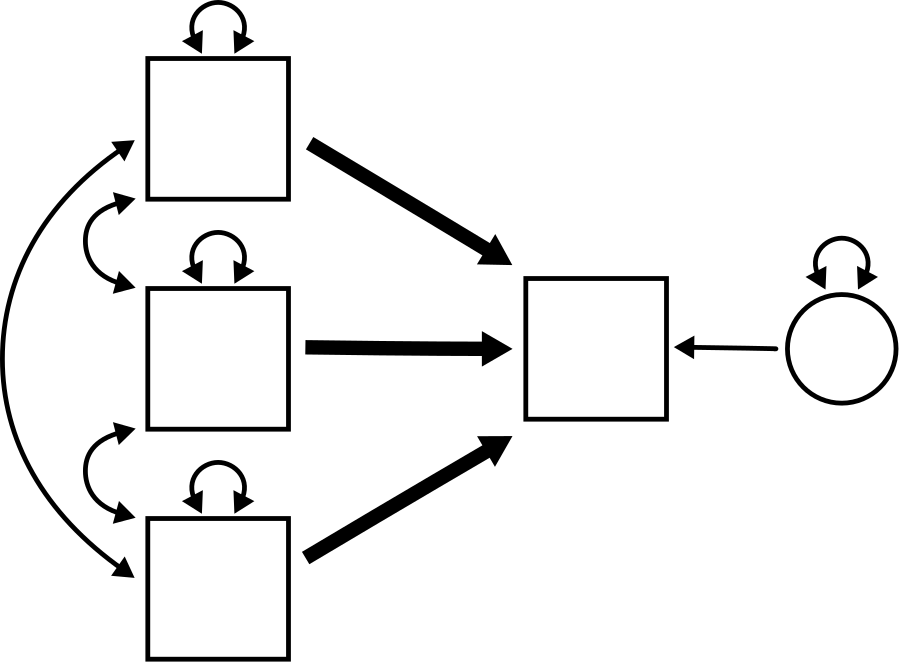
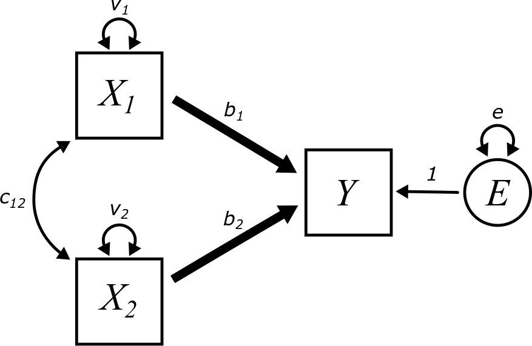
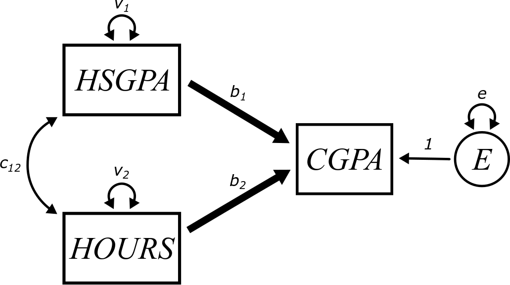
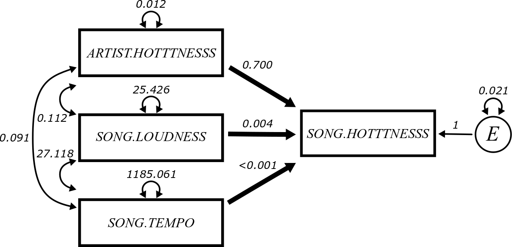
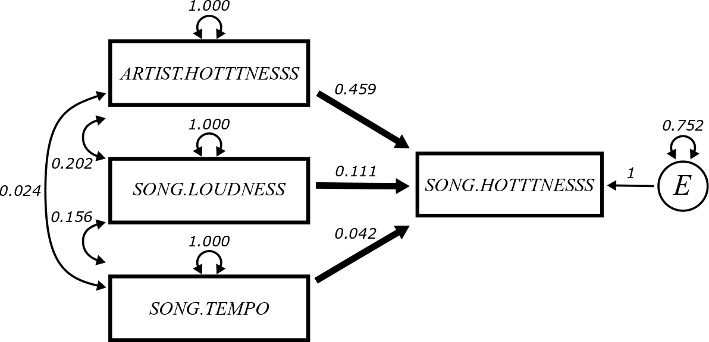

# Multiple regression {#multiple}

```{r, echo = FALSE, fig.align= "center"}

```


## Preliminaries {-}

We will load the `tidyverse` package to work with tibbles, the `broom` package to calculate residuals, and `lavaan`.

```{r}
library(tidyverse)
library(broom)
library(lavaan)
```


## The multiple regression model {#multiple-model}

This chapter is an extension of all the ideas established in the [last chapter](#simple). Multiple regression is like simple regression, but with more exogenous variables. There will still be only one endogenous variable. Although the archetype illustrated at the beginning of the chapter has three predictor variables, we will start with only two predictor variables to keep things simple. If you understand what happens with two variables, it's fairly straightforward to generalize that knowledge to three or more predictors. The logic is the same.

Here is a multiple regression model with two predictors and with all paths given parameter labels:

```{r, echo = FALSE, fig.align= "center"}

```

::: {.rmdnote}

How many free parameters appear in this model?

How many fixed parameters appear in this model?

:::

The equation describing the relationship among these variables can be written as either

$$
\hat{Y} = b_{1}X_{1} + b_{2}X_{2}
$$

or

$$
Y = b_{1}X_{1} + b_{2}X_{2} + E
$$

::: {.rmdnote}

Why do we use $\hat{Y}$ in the first equation and $Y$ in the second equation?

:::

Although we'll work through the details for only two predictors, a multiple regression model with $k$ predictors will look like

$$
\hat{Y} = b_{1}X_{1} + b_{2}X_{2} + \dots + b_{k}X_{k}
$$

or

$$
Y = b_{1}X_{1} + b_{2}X_{2}  + \dots + b_{k}X_{k} + E
$$


## Multiple regression assumptions {#multiple-assumptions}

Fortunately, the assumptions for multiple regression are basically the same as they are for simple regression with a few minor modifications and one addition:

1. The data should come from a "good" sample.
2. The exogenous variables should be measured without error.
3. The relationship between $X_{1}, \dots, X_{k}$, and $Y$ should be approximately linear.
4. The residuals should be independent of the $X_{1}, \dots, X_{k}$ values.
5. There should be no influential outliers.
6. The exogenous variables should not be highly correlated with one another.

We discuss these briefly:

1. Nothing has changed here. Good analysis starts with good data collection practices.
2. Nothing has changed here. It's a good idea to try to measure all our variables with as little error as possible, but in particular, measurement errors in the exogenous variables can bias our parameter estimates.
3. With only $Y$ against $X$, the regression model is a line. With $Y$ against $X_{1}$ and $X_{2}$, the regression model is a plane (a 2-dimensional plane sitting in 3-dimensional space) which is a little challenging to graph. With more predictors, the regression model lives in even higher dimensions and it's impossible to visualize. To check this condition, the best you can usually do is to check that the scatterplots of $Y$ against each $X_{i}$ individually are approximately linear.
4. Once we fit the model, we can check the residuals. Rather than plotting the residuals against each $X_{i}$ separately, we can employ a trick that we'll explain later in the chapter.
5. Nothing changes here.
6. This is the new condition. When two or more predictors variables are highly correlated with each other, this induces a condition called *multicollinearity*.

To illustrate why multicollinearity is a problem, think about the two-variable case:

$$
\hat{Y} = b_{1}X_{1} + b_{2}X_{2}
$$
In general, we will be able to compute the values of $b_{1}$ and $b_{2}$ that best fit the model to data.

But now suppose that $X_{2}$ is just a multiple of $X_{1}$, say $X_{2} = 2X_{1}$. Now the equation looks more like

\begin{align}
\hat{Y} &= b_{1}X_{1} + b_{2}X_{2} \\
        &= b_{1}X_{1} + b_{2}(2 X_{1}) \\
        &= (b_{1} + 2b_{2})X_{1}
\end{align}

So even though it "looked like" there were two distinct predictors variables, this is just a simple regression in disguise. Okay, so now let's suppose we try to calculate the slope of this simple regression. Say it's 10. What are the values of $b_{1}$ and $b_{2}$? In other words, what values of $b_{1}$ and $b_{2}$ solve the following equation?

$$
b_{1} + 2b_{2} = 10
$$

::: {.rmdnote}

Explain why it is impossible to pin down unique values for $b_{1}$ and $b_{2}$ that make the above equation true.

If you choose a large, negative value of $b_{1}$, what does that imply about the value of $b_{2}$?

If you choose a large, positive value of $b_{1}$, what does that imply about the value of $b_{2}$?

:::

Multicollinearity works a lot like that. Even when variables are not exact multiples of each other, sets of highly correlated variables will result in equations with a large range of possible values that are consistent with the data. Even more dangerously, your fitting algorithm may estimate values for these coefficients, but those numbers will likely be meaningless. A completely different set of numbers may also be perfectly consistent with the data.

To be clear, it's not a problem that there is covariance among our predictors. We expect that. The problem only arises when two or more predictors are *highly* correlated with each other.


## Calculating regression parameters {#multiple-calculating}

There is nothing new here, but the calculations do start to get a little messy. Everything that follows is for two predictors only. We will not do any calculations for three or more predictors. It gets out of hand pretty quickly.

First, let's remember what we're trying to do. From the data, we can calculate the sample covariance matrix. These are all the variances and covariances among the observed variables:

$$
\begin{bmatrix}
Var(X_{1})          &   \bullet         &   \bullet \\
Cov(X_{2}, X_{1})   &   Var(X_{2})      &   \bullet \\
Cov(Y, X_{1})       &   Cov(Y, X_{2})   &   Var(Y)
\end{bmatrix}
$$

Remember that these entries are all just numbers that we calculate directly from the data.

To get started on the model-implied matrix, let's extend [**Rule 12**](./covariance.html#Rule12) a little.

::: {.rmdimportant}

For any three variables $X_{1}$, $X_{2}$, and $X_{3}$:

\begin{align}
Var(aX_{1} + bX_{2} + cX_{3}) &= 
    a^2Var(X_{1}) + b^2Var(X_{2}) + c^2Var(X_{3}) \\
    & \quad + 2abCov(X_{1}, X_{2}) \\
    & \quad + 2acCov(X_{1}, X_{3}) \\
    & \quad + 2bcCov(X_{2}, X_{3})
\end{align}

This can be extended to any number of variables. Each variance appears with a coefficient squared and each pair of variables gets a covariance term with 2 times the product of the corresponding variable coefficients. (It's hard to describe in words, but it's still more trouble than it's worth writing it down in formal mathematical notation. Hopefully you can see how the pattern of coefficients generalizes.)

:::

Now we can compute, for example, $Var(Y)$:

\begin{align}
Var(Y)  &= Var(b_{1}X_{1} + b_{2}X_{2} + E) \\
    &= b_{1}^{2} Var(X_{1}) + b_{2}^{2} Var(X_{2}) + Var(E) \\
    & \quad + 2b_{1}b_{2} Cov(X_{1}, X_{2}) \\
    & \quad + 2b_{1} Cov(X_{1}, E) \\
    & \quad + 2b_{2} Cov(X_{2}, E)
\end{align}

::: {.rmdnote}

What happens to the last two lines above? Why?

:::

Therefore,

$$
Var(Y) = b_{1}^{2} v_{1} + b_{2}^{2} v_{2} + 2b_{1}b_{2} c_{12} + e
$$

[**Rule 8**](./covariance.html#Rule8) and [**Rule 9**](./covariance.html#Rule9) extend in a similar way to sums of three or more terms. But that's even easier: just split up the covariance into as many pieces as there are terms to split.

::: {.rmdnote}

Your turn.

Calculate $Cov(Y, X_{1})$. You should get

$$
b_{1} v_{1} + b_{2} c_{12}
$$
Calculate $Cov(Y, X_{2})$. You should get

$$
b_{2} v_{2} + b_{1} c_{12}
$$
:::

That turns out to be all the computation we need to write down the model-implied matrix.

The first three entries are easy because they are just the parameters $v_{1}$, $c_{12}$, and $v_{2}$. The last column contains the entries we just calculated above.

Therefore, the model-implied matrix is

$$
\begin{bmatrix}
v_{1}   &   \bullet &  \bullet  \\
c_{12}  &   v_{2}   &  \bullet \\
b_{1} v_{1} + b_{2} c_{12}  &  b_{2} v_{2} + b_{1} c_{12}  &   b_{1}^{2} v_{1} + b_{2}^{2} v_{2} + 2b_{1}b_{2} c_{12} + e
\end{bmatrix}
$$
If we set these expressions equal to the numbers from the sample covariance matrix, *in theory* we could then solve for the unknown parameters in the model-implied matrix above. Three of them are basically already done since we can just read off $v_{1}$, $c_{12}$, and $v_{2}$. But solving for $b_{1}$, $b_{2}$, and $e$ is no joke! And even if we did, the resulting expressions are not particularly enlightening. This is where we are quite happy turning over the computational details to a computer.


## Interpreting the coefficients {#multiple-interpreting}

Without explicit mathematical expressions for these parameters, it's a bit challenging to explain their interpretation. For now, we'll take it on faith that the following is true:

::: {.rmdnote}

In a multiple regression model, each $b_{i}$ represents the slope of the linear association between $Y$ and $X_{i}$ *while holding the value of all other predictors constant*.

:::

What does this mean?

Let's work with a concrete example. Suppose we think that college GPA can be predicted using high school GPA along with the number of hours per week spent studying in college. Here is what such a model might look like:

```{r, echo = FALSE, fig.align= "center"}

```

If high school GPA and hours per week studying are correlated (and they likely are), they influence each other, and some of the influence has the danger of "corrupting" the estimates of the path coefficients. For example, if $b_{2}$ is positive, that would suggest that hours spent studying is associated with predicted increases in college GPA. But how do we know that's really due to the studying? Maybe students who did well in high school are just "smarter".^[For the record, we don't actually believe that is true.] Sure, they also put in more hours studying, but maybe that doesn't matter. Maybe those students would do just as well in college even if they didn't study a whole lot. If that were the case, the coefficient $b_{2}$ would be positive just because that set of students (who happen to study more, even though it doesn't matter) also are the ones who have high college GPAs.

This is why it's important to *control* for other variables. All this means is that we need to temporarily fix the value of other variables to make the comparison fair. For example, we could look only at students with a 3.0 in high school. Among those students, there will be variability in the number of hours they study in college. If that variability is associated with variability in college GPA, we know that the hours spent studying is at least partly associated with that change. (There are lots of other factors too, but those will be swept up in the error variance.) The high school GPA can't predict that because it was fixed at 3.0, so we're comparing apples to apples. Students who got a 2.0 in high school may do more poorly overall, but the relative increase in GPA due to studying would be the same (at least if everything is linear, as is assumed).

If the parameter $b_{2}$ is estimated to be 0.13, that suggests that each additional hour of study time per week predicts an increase of 0.13 points in the college GPA, holding high school GPA constant. This means that the increase of 0.13 is only predicted within groups of students with the same high school GPA.

If the parameter $b_{1}$ is estimated to be 1.2, that suggests that college GPA is predicted to increase 1.2 points for every point increase in high school GPA. This coefficient can only be interpreted while holding hours per week studying constant. This means that this estimate only makes sense to interpret within groups of students who put in the same number of hours of studying. That takes out the hours of studying as an explanation and only accounts for changes in high school GPA to be associated with changes in college GPA.


## Regression with standardized variables {#multiple-standardized}

Things get a little easier (although not completely trivial) with standardized variables.

First, a notational simplification. The correlations between our variables---according to our convention---would be called $r_{X_{2}X_{1}}$, $r_{YX_{1}}$, and $r_{YX_{2}}$. These are a little hard to look at in complex expressions, so we will replace them with $r_{21}$, $r_{Y1}$, and $r_{Y2}$. (Don't be confused by $r_{21}$ vs $r_{12}$ or $c_{21}$ vs $c_{12}$. Since covariance and correlation are symmetric, the order of the subscripts does not matter.)

Let's look at the sample covariance matrix and the model-implied matrix for standardized variables:

$$
\begin{bmatrix}
1       &   \bullet &   \bullet    \\
r_{21}  &   1       &   \bullet    \\
r_{Y1}  &   r_{Y2}  &   1
\end{bmatrix} = 
\begin{bmatrix}
v_{1}   &    \bullet  &   \bullet \\
c_{12}  &    v_{2}   &    \bullet \\
b_{1} v_{1} + b_{2} c_{12} &    b_{2} v_{2} + b_{1} c_{12} &   b_{1}^{2} v_{1} + b_{2}^{2} v_{2} + 2b_{1}b_{2} c_{12} + e
\end{bmatrix}
$$
The entry in the lower-left corner yields

$$
r_{Y1} = b_{1} v_{1} + b_{2} c_{12}
$$
which simplifies to
$$
r_{Y1} = b_{1} + b_{2} r_{21}
$$
The next entry to the right of that yields

$$
r_{Y2} = b_{2} v_{2} + b_{1} c_{12}
$$
which simplifies to
$$
r_{Y2} = b_{2} + b_{1} r_{21}
$$

These two equations can be solved for the two unknown parameters $b_{1}$ and $b_{2}$.

::: {.rmdnote}

Are you feeling brave? Are your algebra skills sharp? Totally optional, but see if you can derive the final answers below:

$$
b_{1} = \frac{r_{Y1} - r_{Y2}r_{21}}{1 - r_{21}^{2}}
$$

$$
b_{2} = \frac{r_{Y2} - r_{Y1}r_{21}}{1 - r_{21}^{2}}
$$

:::

These are still pretty gross, but there is some intuitive content to them. Look at the numerator of the fraction for $b_{1}$. Essentially, this is just $r_{Y1}$ with some extra stuff. If this were simple regression, we would expect the slope $b_{1}$ to simply be the correlation between $X_{1}$ and $Y$. But in multiple regression, we also have to *control* for any contribution to the model coming from $X_{2}$. How do we do that? By subtracting off that contribution, which turns out to be $r_{Y2}r_{21}$. And why does the latter term appear the way it does? Because we only need to control for the effect of $X_{2}$ if $X_{2}$ is providing some of the same "information" to the regression model as $X_{1}$. Therefore, we don't need to subtract *all* of $r_{Y2}$ to control for $X_{2}$, just a *fraction* of $r_{Y2}$. What fraction? $r_{21}$! We just need the part of $X_{2}$ that it has in common with $X_{1}$. We don't want to "double-count" the contribution to the model that is common to both $X_{2}$ and $X_{1}$.

::: {.rmdnote}

Here's another way to think about it. What if $X_{1}$ and $X_{2}$ are independent? Calculate $b_{1}$ and $b_{2}$ from the above formulas in this much easier case. (Don't overthink this. What is $r_{21}$ in this case?)

:::

So if $X_{1}$ and $X_{2}$ are independent, they both offer a unique contribution to predicting $Y$ in the model. And that contribution is just their correlation with $Y$ ($r_{Y1}$ and $r_{Y2}$, respectively). There is no overlap. But if $X_{1}$ and $X_{2}$ are correlated, then some of their "influence" is counted twice. We have to subtract out that influence so that $b_{1}$ and $b_{2}$ are only measuring the "pure" contribution of $X_{1}$ and $X_{2}$, controlling for the other one.

What about the $1 - r_{21}^{2}$ in the denominator? There's less of a good intuitive explanation here. It's there because---mathematically speaking---it has to be there. It rescales the slope coefficients to make everything work out the way it has to.

The final equation is the one for $Var(Y)$ in the lower-right corner of the matrix. It says

$$
1 = b_{1}^{2} v_{1} + b_{2}^{2} v_{2} + 2b_{1}b_{2} c_{12} + e
$$
which simplifies to
$$
1 = b_{1}^{2} + b_{2}^{2} + 2b_{1}b_{2} r_{21} + e
$$
Rearranging to solve for $e$,
$$
e = 1 - \left(b_{1}^{2} + b_{2}^{2} + 2b_{1}b_{2} r_{21}\right)
$$
It is *not* enlightening in any way to replace $b_{1}$ and $b_{2}$ here with the earlier fractions. We can leave $e$ like this.

Since the standardized variance of $Y$ is 1, the stuff inside the parentheses above represents the variance *accounted for by the model*. (That is subtracted from 1, then, to be left with $e$, the error variance.) This is analogous to the $R^{2}$ term described in the [last chapter](#simple-coefficients-correlation).

This makes some conceptual sense too. All the pieces of $\left(b_{1}^{2} + b_{2}^{2} + 2b_{1}b_{2} r_{21}\right)$ correspond to various pieces of the model. The first two relate to the direct effects of $X_{1}$ and $X_{2}$ and the third piece relates to an "indirect" effect shared between them.


## Multiple regression in R {#multiple-r}

Let's fit a multiple regression model on some data about music. The data is a sample of 10,000 songs from the [Million Song Dataset](http://millionsongdataset.com/), a collection of metrics about the audio for a million contemporary popular music tracks.

This data set was downloaded from the [CORGIS Dataset Project](https://corgis-edu.github.io/corgis/csv/) and more information about the variables in this data set can be found [here](https://corgis-edu.github.io/corgis/csv/music/).

```{r}
music <- read_csv("https://raw.githubusercontent.com/VectorPosse/sem_book/main/data/music.csv")
music
```

The endogenous variable of interest to us will be the measure of the song's popularity, called `song.hotttnesss` (on a scale from 0 to 1).^[Very important that there are three t's and three s's!] There are many possible exogenous predictors, but let's focus on three:

-  `artist.hotttnesss`
    -  This is the popularity of the artist (on a scale from 0 to 1).
-  `song.loudness`
    -  Not clear from the website what this is exactly, but it appears to be some kind of average dBFS (decibels relative to full scale). Numbers close to zero are actually as loud as recordings reasonably go and increasingly negative numbers represent softer volumes.
-  `song.tempo`
    -  This is measured in beats per minute (BPM).

Let's plot `song.hotttnesss` against each of the three proposed predictors to test the linearity assumption, starting with `artist.hotttnesss`:

```{r}
ggplot(music, aes(y = song.hotttnesss,
                  x = artist.hotttnesss)) +
    geom_point()
```

Uh, we've got some issues here to deal with. Since `song.hotttness` is supposed to be from 0 to 1, we can guess that the -1 values are likely coded to represent "missing" data. Even the values of 0 don't seem valid given that there is a big gap between the row of zeros and any of the rest of the cluster of actual data. The `artist.hotttness` variable also seems to have some zeros that are disconnected from the rest of the data. These may be genuine outliers, but it's more likely that these were artists for whom no data was collected.

While we're suspecting issues, let's also check `song.loudness` and `song.tempo`.

```{r}
ggplot(music, aes(y = song.hotttnesss,
                  x = song.loudness)) +
    geom_point()
```

The `song.loudness` distribution looks reasonable. It's definitely skewed to the left, but there are no strict requirements about the predictor variables having any particular type of distribution.

```{r}
ggplot(music, aes(y = song.hotttnesss,
                  x = song.tempo)) +
    geom_point()
```

::: {.rmdnote}

Is it possible for a song tempo to be 0 BPM?

:::

To make it a little cleaner, the following code will `select` only the variables in which we're interested. Then it will `filter` out the values we want to keep (discarding the ones that represent missing/invalid data). We'll put this into a new tibble called `music_clean`.

```{r}
music_clean <- music %>%
    select(song.hotttnesss, artist.hotttnesss,
           song.loudness, song.tempo) %>%
    filter(song.hotttnesss > 0,
           artist.hotttnesss > 0,
           song.tempo > 0)
music_clean
```
This has reduced the number of rows to 4,157, but that is still a huge sample size.

Let's check the scatterplots once more, now with the `music_clean` data.

```{r}
ggplot(music_clean, aes(y = song.hotttnesss,
                        x = artist.hotttnesss)) +
    geom_point()
```

```{r}
ggplot(music_clean, aes(y = song.hotttnesss,
                        x = song.loudness)) +
    geom_point()
```

```{r}
ggplot(music_clean, aes(y = song.hotttnesss,
                        x = song.tempo)) +
    geom_point()
```

There doesn't appear to be much of an association with loudness or tempo. But that doesn't violate any assumptions. (A violation of the assumptions would be a decidedly non-linear association, not just a near-zero association.) Given these graphs, we will expect the model to tell us that song popularity is maybe somewhat associated with artist popularity, but not much with loudness or tempo.

### Using `lm` {#multiple-r-lm}

The `lm` model specification is a minor extension of what you learned for simple regression. Just use plus signs on the right side of the tilde ~ to add more predictors. Be sure to use `music_clean` and not `music`!

```{r}
SONG_lm <- lm(song.hotttnesss ~ artist.hotttnesss +
                  song.loudness +
                  song.tempo,
              data = music_clean)
SONG_lm
```

We didn't go to the trouble of mean-centering the data this time, so the intercept is no longer 0. But we will not attempt to interpret the intercept anyway. The other three coefficients are $b_{1}$, $b_{2}$ and $b_{3}$, the path coefficients of the model. These are interpreted as follows:

-  $b_{1}$:
    -  Song popularity is predicted to increase 0.7 points for every point increase in artist popularity.

While this is mathematically true, it's kind of nonsensical to report using numbers of that magnitude. Both scales only go from 0 to 1, so an increase in 1 point would be measuring the difference between an artist with 0 popularity (the lowest possible value of popularity) to an artist with 1 popularity (the highest possible value of popularity).

A better way to report this would be to scale everything down by a factor of 10:

-  Song popularity is predicted to increase 0.07 points for every 0.1 increase in artist popularity.

-  $b_{2}$:
    -  Song popularity is predicted to increase 0.004 points for every increase of 1 dB of loudness.
    
An increase of 1 dB is not very much, so again, we can scale the result to make it more meaningful. This time we'll multiply by a factor of 10:

-  Song popularity is predicted to increase 0.04 points for every increase of 10 dB of loudness.

-  $b_{3}$:
    -  Song popularity is predicted to increase 0.0002 points for every increase of 1 BPM in the tempo.
    
::: {.rmdnote}

Restate the interpretation of $b_{3}$ on a scale that makes sense. If you're not familiar with BPM, Google it to get a sense of what a reasonable jump in tempo might be.

:::

Now that we have the model fit, we can use `broom` to capture the residuals.

```{r}
SONG_aug <- augment(SONG_lm)
SONG_aug
```

But how do we graph them now that there are three predictor variables? We could graph the residuals against all three predictors separately, but there's a more efficient method.

::: {.rmdnote}

Calculate

$$
Cov(E, \hat{Y})
$$
by substituting

$$
\hat{Y} = b_{1}X_{1} + b_{2}X_{2} + b_{3}X_{3} 
$$

If we assume that $E$ is independent of all the predictors, what is the value of $Cov(E, \hat{Y})$?

:::

Of course, if $Cov(E, \hat{Y}) = 0$, that does not necessarily imply that all the $Cov(E, X_{i})$ must be zero. And even if those are zero, that doesn't imply independence. But if $Cov(E, \hat{Y}) \neq 0$, then we know at least one of the $Cov(E, X_{i})$ also must be non-zero. **Therefore, we can plot the residuals against the fitted values and this will serve as a *disqualifying* condition. A problem in the plot of residuals against fitted values serves as evidence of a problem with the model.**

One of the nice features of the `augment` output is that it also has a column called `.fitted` that stores the $\hat{Y}$ values.

Here are the (standardized) residuals graphed against the fitted values:

```{r}
ggplot(SONG_aug, aes(y = .std.resid, x = .fitted)) +
    geom_point() +
    geom_hline(yintercept = 0, color = "red")
```

The weirdness in the residuals is not ideal. It doesn't prevent us from fitting the model, but we will state our results cautiously knowing that variance toward the left half of the graph is compressed relative to the right side of the graph. Therefore, the error variance is not "acting" in the model the same way across all combinations of the predictor variables.

::: {.rmdnote}

Go back and look at the original scatterplots of the data (from `music_clean` and see if you can figure out why the residuals are cut off funny like that in the lower left quadrant.)

:::

### Using `lavaan` {#multiple-r-lavaan}

Model specification in `lavaan` happens in a separate step with the model in quotes:

```{r}
SONG_model <- "song.hotttnesss ~ artist.hotttnesss +
    song.loudness + 
    song.tempo" 
```

Then the model is fit with the `sem` function.

```{r}
SONG_fit <- sem(SONG_model, data = music_clean)
```

Here are the unstandardized parameter estimates:

```{r}
parameterEstimates(SONG_fit)
```

Focus on the estimate column (`est`).

::: {.rmdnote}

Do you recognize the values from lines 1 through 3?

What does line 4 mean? (Hint: it's not the variance of `song.hotttnesss` even though the notation makes it look like that.)

What's going on in lines 5 through 10?

:::

Here are the standardized parameter estimates:

```{r}
standardizedSolution(SONG_fit)
```

Focus on the estimates again (`est.std`).

::: {.rmdnote}

Why is it easier to compare the values in lines 1 though 3 in this output than it was in the unstandardized table? (Hint: think about units of measurement or lack thereof.)

What does the value in line 4 tell you? (Hint: it's closer to 1 than to 0.)

Why are lines 5, 8, and 10 equal to 1?

How do you interpret lines 6, 7, and 9?

:::

This is the final model with all variables labeled and all unstandardized parameter estimates identified:

```{r, echo = FALSE, fig.align= "center"}

```

This is the same thing, but with standardized parameter estimates:

```{r, echo = FALSE, fig.align= "center"}

```