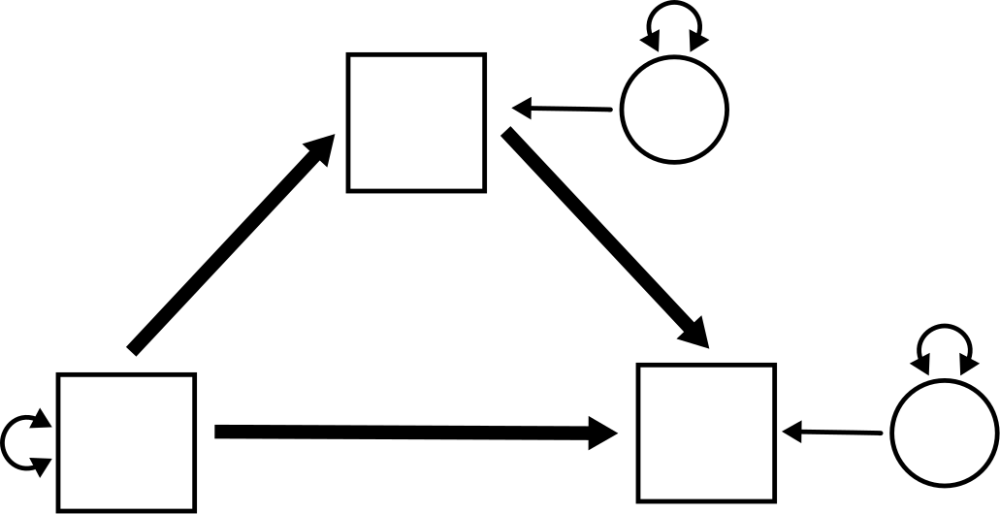
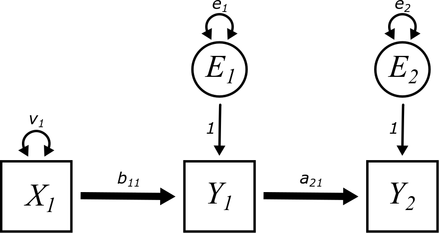
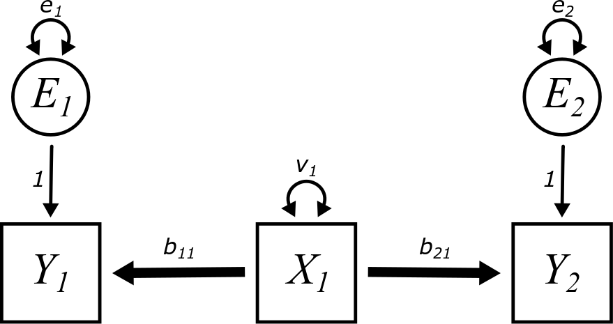
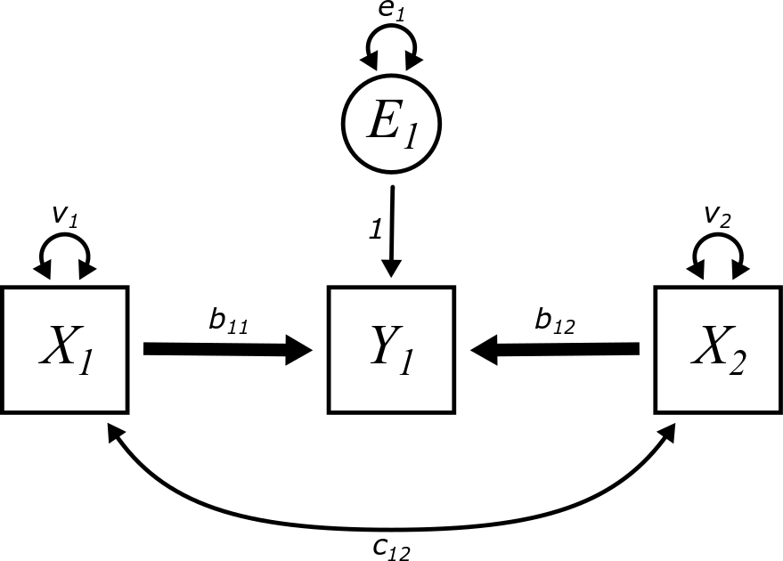
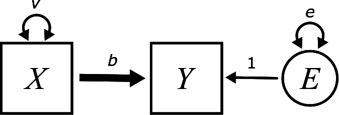
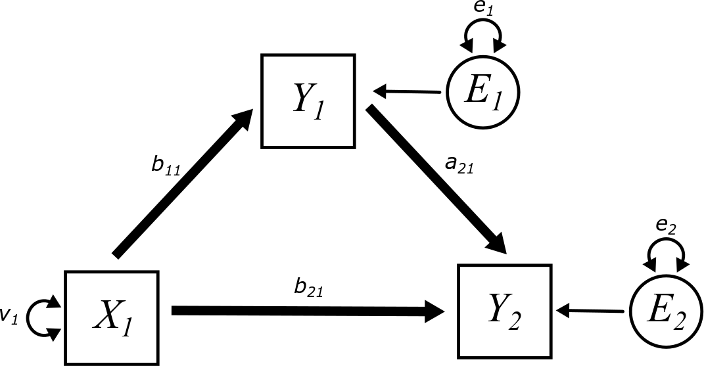

# Mediation {#mediation}

```{r, echo = FALSE, fig.align= "center"}

```


## Preliminaries {-}

We will load the `tidyverse` package to work with tibbles and `lavaan`.

```{r}
library(tidyverse)
library(lavaan)
```


## Arrows going everywhere! {#mediation-arrows}

To start off, let's look at all possible paths that connect three variables with two arrows. (For the moment, we'll leave out variances, covariances, and error terms.)

```{r, echo = FALSE, fig.align= "center"}

```

```{r, echo = FALSE, fig.align= "center"}

```

```{r, echo = FALSE, fig.align= "center"}

```

```{r, echo = FALSE, fig.align= "center"}

```

The second model is just a copy of the first model reversed, so we can disregard it. The other three models are genuinely distinct models with somewhat different consequences for the relationship among the three variables:

* The first model represents a "mediator".
* The third model represents a "confounder".
* The fourth model represents a "collider".

The first part of this chapter will make these distinctions clear.


## Exogenous and endogenous variables {#mediation-exogenous-endogenous}

Look at the first model above. It's clear that the variable on the left is exogenous and the variable on the right is endogenous. The middle variable is called a *mediator*. Is it exogenous or endogenous?

Here we give a more specific definition of these two terms:

::: {.rmdimportant}

An *exogenous* variable is one that has no unidirectional arrows (so not counting double-headed arrows) entering it in the model diagram. It has only unidirectional arrows leaving it.

An *endogenous* variable is one that has at least one unidirectional arrow entering it (again, not counting double-headed arrows). It may have other unidirectional arrows both entering and/or leaving.

:::

* The prefix *exo-* means "outside". So whatever variability there is in an exogenous variable must come from "outside" the model. There are no unidirectional arrows coming in, so there is nothing in the model to account for its variance, or, for that matter, its covariance with other exogenous variables.

* The prefix *endo-* means "within". The variability of endogenous variables is accounted for by other variables (including error terms) inside the model. The fact that there might be arrows leaving endogenous variables is irrelevant for this definition. It's only about arrows coming in.

::: {.rmdnote}

According to the definition above, is a mediator exogenous or endogenous?

:::

Here are the Really Important Rules (RIR&trade;) for working with exogenous and endogenous variables in models. They come in three pairs:

::: {.rmdimportant}

* **Rule 1:**
    * Every exogenous variable in a model requires a double-headed arrow pointing to itself, representing its variance.
    * No endogenous variable should have a double-headed arrow pointing to itself.

* **Rule 2:**
    * Every pair of exogenous variables in a model---except error terms---requires a double-headed arrow joining them, representing their covariance.
    * No other pair of variables in a model (between exogenous and endogenous, or between endogenous) should have a double-headed arrow joining them.
    
* **Rule 3:**
    * Every endogenous variable in a model requires an error term.
    * No exogenous variable in a model should have an error term.

:::

These rules have important justifications. Don't just memorize the rules blindly. Understand why they are imperative.

* **Rule 1:**
    * Exogenous variables vary, but the source of their variance is not in the model. (That's what makes them exogenous.) Therefore, we have to represent their variance "manually" in the model by indicating it with a double-headed arrow.
    * On the other hand, the variance of endogenous variables is accounted for by other variables in the model already, so it doesn't need a separate parameter representing its variance.

* **Rule 2:**
    * Pairs of exogenous variables co-vary. The source of that covariance is not in the model, so we have to represent it "manually" by indicating it with a double-headed arrow. Error terms are the exception to this rule. While it's possible that error terms can co-vary, that usually isn't sensible for most models. A future chapter [LINK] will cover how and when error terms can be correlated, but it should never be the default assumption of the model.
    * Covariances between other types of variables (exogenous to endogenous, or endogenous to endogenous) are consequences of the other arrows in the diagram that create direct and indirect paths among the variables, so their covariance is not separately drawn as a double-headed arrow.

* **Rule 3:**
    * While the model is supposed to account for the variance of endogenous variables through incoming arrows, it will never be able to explain 100\% of that variance just using other variables in the model. There will always be residuals, so these residuals have to be represented "manually" in the model using error terms.
    * Exogenous variables are assumed to be measured without error. While that assumption is not always very realistic in the real world, we don't have much of a choice. By their very definition, the variance of exogenous variable isn't accounted for by anything else in the model, so error terms just don't make any sense for them.

::: {.rmdnote}

Here's the first model of the four shown earlier:

```{r, echo = FALSE, fig.align= "center"}

```

Draw this model on your own piece of paper. Following the rules above, draw in all variances, covariances, or error terms that should be present in the diagram. (Don't worry about labeling anything with letters yet. Just draw the arrows and the circles.)

:::


## Naming conventions {#mediation-naming}

We need to establish some conventions for naming things.

* We need to name our variables. When we model real-world data, we'll use contextually meaningful names, but for abstract models we draw, we need a consistent way of labeling them.
    * Exogenous variables will be called $X_{i}$ (using numbers as subscripts).
    * Endogenous variables will be called $Y_{i}$ (also using numbers as subscripts).
    * Error terms will be called $E_{i}$ with subscripts matching the ones on the endogenous variables $Y_{i}$ to which they're attached.

* We need to label the parameters along the various paths of the model:
    * Variances will be called $v_{i}$ with subscripts matching the exogenous variables $X_{i}$ to which they're attached.
    * Error variances will be called $e_{i}$ with subscripts matching the error terms $E_{i}$ to which they're attached.
    * Covariances will be called $c_{ij}$ connecting exogenous variables $X_{i}$ and $X_{j}$. (Since covariance is symmetric, it could also be called $c_{ji}$.)
    * Unidirectional arrows from error terms to their corresponding endogenous variables will always be fixed parameters labeled with "1".
    * Thick, unidirectional arrows between an exogenous variable $X_{i}$ and an endogenous variable $Y_{j}$ will be called $b_{ji}$. Note the order of the subscripts: we always start with the subscript of the target variable and end with the subscript of the predictor.
    * Thick, unidirectional arrows between an endogenous variable $Y_{i}$ and another endogenous variable $Y_{j}$ will be called $a_{ji}$.

::: {.rmdnote}

Why do we not need a naming convention for thick arrows between two exogenous variables?

:::


## Mediators {#mediation-mediators}

With all the rules in place for our diagrams, we can now revisit the model from above, but now, let's include all the extra bits of the model required by the aforementioned rules: a variance term for the exogenous variable $X_{1}$, error terms for the two endogenous variables $Y_{1}$ and $Y_{2}$, and parameter labels for everything.

```{r, echo = FALSE, fig.align= "center"}

```

::: {.rmdnote}

Why did we not include any covariances in the model above?

:::

As a concrete example to illustrate this phenomenon, imagine that the variables measure the following:

* $X_{1}$ is smoking.
* $Y_{1}$ is tar deposits in the lungs.
* $Y_{2}$ is lung cancer.

The idea is that smoking is associated with lung cancer. But what smoking *really* does is cause specific chemical processes in the lungs (including the deposition of tar), and that---among other factors---is what contributes to lung cancer. Tar serves as a "mediator" for the process that connects smoking to lung cancer.

Since there are two endogenous variables present in this model, there are two regression equations we have to write down:

\begin{align}
Y_{1} &= b_{11}X_{1} + E_{1}        \\
Y_{2} &= a_{21}Y_{1} + E_{2}
\end{align}

The sample covariance matrix will look like

$$
\begin{bmatrix}
Var(X_{1})          &   \bullet             &   \bullet \\
Cov(Y_{1}, X_{1})   &   Var(Y_{1})          &   \bullet \\
Cov(Y_{2}, X_{1})   &   Cov(Y_{2}, Y_{1})   &   Var(Y_{2})
\end{bmatrix}
$$

::: {.rmdnote}

When working through covariance calculations in the past chapters, we've seen lots of terms pop out of the form $Cov(E, X)$. We've gotten used to canceling these terms because they are zero. (Why must they be zero?)

In this model, some of the covariance calculations will result in terms of the form $Cov(E, Y)$. These will not necessarily cancel, so we need to be more cautious.

Calculate $Cov(E_{1}, Y_{1})$ for the model above by substituting the regression equation $Y_{1} = b_{11}X_{1} + E_{1}$. You should get $e_{1}$ (and *not* zero).

Without doing any calculations, why would we also expect $Cov(E_{1}, Y_{2})$ to be non-zero? (Hint: how are $E_{1}$ and $Y_{2}$ connected in the diagram?)

On the other hand, why would we expect $Cov(E_{1}, E_{2})$ to be zero in general? (Hint: look back to Really Important Rule 2 above.)

Finally, we *will* expect $Cov(E_{2}, Y_{1})$ to be zero. Why? If you're stuck, go ahead and do the calculation to confirm.

:::

::: {.rmdnote}

Calculate the full model-implied matrix. You should get the following:

$$
\begin{bmatrix}
v_{1}   &   \bullet &  \bullet  \\
b_{11}v_{1}  &   b_{11}^{2}v_{1} + e_{1}   &  \bullet \\
a_{21}b_{11}v_{1}  &  a_{21}b_{11}^{2}v_{1} + a_{21}e_{1}  &   a_{21}^{2}b_{11}^{2}v_{1} + a_{21}^2e_{1} + e_{2}
\end{bmatrix}
$$

If this is too tedious and time-consuming, just pick one or two of these entries to compute.

:::

If we standardize our variables, the sample covariance matrix (which is now a correlation matrix) is

$$
\begin{bmatrix}
1                   &   \bullet             &   \bullet \\
Corr(Y_{1}, X_{1})  &   1                   &   \bullet \\
Corr(Y_{2}, X_{1})  &   Corr(Y_{2}, Y_{1})   &   1
\end{bmatrix}
$$
We've switched to using $Corr$ instead of using the letter $r$ for this exercise. That's because $r_{Y_{1}X_{1}}$, $r_{Y_{2}X_{1}}$, and $r_{Y_{2}Y_{1}}$ have subscripts inside of subscripts and are hard to read and process.

::: {.rmdnote}

Setting the correlation matrix equal to the model-implied matrix above, we get
$$
v_{1} = 1
$$
pretty much for free.

Now solve for $b_{11}$ and $e_{1}$ next using the two terms in the second row of the matrix. You should get:

\begin{align}
b_{11}  &= Corr(Y_{1}, X_{1})       \\
e_{1}   &= 1 - Corr(Y_{1}, X_{1})^{2}
\end{align}

Why is this not surprising? (Hint: if you ignore $Y_{2}$ altogether and only pay attention to relationships between $X_{1}$, $Y_{1}$, and $E_{1}$, what kind of model is this?)

:::

The parameter $a_{21}$ is interesting. The equation implied by the lower-left element of the matrix---corresponding to $Corr(Y_{2}, X_{1})$---is

\begin{align}
Corr(Y_{2}, X_{1})  &= a_{21}b_{11}v_{1}        \\
                    &= a_{21}Corr(Y_{1}, X_{1})
\end{align}

Solving for $a_{21}$:

$$
a_{21} = \frac{Corr(Y_{2}, X_{1})}{Corr(Y_{1}, X_{1})}
$$

On the other hand, the equation implied by the center element on the bottom row of the matrix---corresponding to $Corr(Y_{2}, Y_{1})$---is

\begin{align}
Corr(Y_{2}, Y_{1})
    &= a_{21}b_{11}^{2}v_{1} + a_{21}e_{1}  \\
    &= a_{21}Corr(Y_{1}, X_{1})^{2} + 
        a_{21}\left( 1 - Corr(Y_{1}, X_{1})^{2} \right) \\
    &= a_{21}Corr(Y_{1}, X_{1})^{2} +
        a_{21} - a_{21}Corr(Y_{1}, X_{1})^{2}       \\
    &= a_{21}
\end{align}

So we get two different answers for $a_{21}$!

::: {.rmdnote}

Use $a_{21} = Corr(Y_{2}, Y_{1})$ along with everything else you've learned to solve for $e_{2}$ using the equation in the lower-right corner of the matrix. (This is the only one we can use because it's the only term involving $e_{2}$!)

It may look ugly, but you might be surprised at the simplicity of the answer that pops out. You should get
$$
e_{2} = 1 - Corr(Y_{2}, Y_{1})^{2}
$$

Again, though, why is that not really all that surprising? (Hint: what if you ignore $X_{1}$ and treat the relationship between $Y_{1}$, $Y_{2}$, and $E_{2}$ as a simple regression?)

:::

Since we got two different answers for $a_{21}$, if this model is correct, they must be equal:

$$
a_{21} = Corr(Y_{2}, Y_{1}) = \frac{Corr(Y_{2}, X_{1})}{Corr(Y_{1}, X_{1})}
$$

which, if we rearrange the fraction, implies

$$
Corr(Y_{1}, X_{1}) Corr(Y_{2}, Y_{1}) = Corr(Y_{2}, X_{1}) 
$$

Another way to state this is that the correlation along the first path ($b_{11}$) and the correlation along the second path ($a_{21}$) multiply to give the correlation along both paths combined.

But these three correlations are numbers that are measured using the data. Is there any guarantee that the product of two of the correlations will necessarily equal the third?

**No!**

In fact, this will almost never be true with real data.

::: {.rmdnote}

So if the model *implies* that there must be a mathematical relationship among the correlations, but the data does not support that implication, what does that say about the model?

:::

::: {.rmdnote}

Think about the ramifications of the above discussion for smoking and lung cancer. Smoking is correlated to tar deposits, and tar deposits are correlated with lung cancer. But if the product of those two correlations doesn't equal the overall correlation between smoking and lung cancer, what does that say about the model? What other "path" might be missing in the model that would help account for the discrepancy?

:::

We'll return to this example in a moment. But first, let's explore the other model configurations set up at the beginning of the chapter.


## Confounders {#mediation-confounders}

The variable in the middle of the diagram below is called a "confounder": 

```{r, echo = FALSE, fig.align= "center"}

```

::: {.rmdnote}

Draw this model on your own piece of paper.

Identify which variables are exogenous or endogenous.

Following the Really Important Rules, draw in all variances, covariances, or error terms that should be present in the diagram.

Finally, see if you can label all paths with letters and subscripts according to the naming conventions described earlier.

:::

Here is the final model:

```{r, echo = FALSE, fig.align= "center"}

```

As a concrete example to illustrate this phenomenon, imagine that the variables measure the following:

* $Y_{1}$ is the presence of power lines near homes.
* $Y_{2}$ is the incidence of cancer.

For a moment, we're not going say what $X_{1}$ is.

::: {.rmdnote}

Does a positive correlation between power lines and cancer imply that living near power lines *causes* cancer?

Does a positive correlation between power lines and cancer imply that cancer *causes* people to live near power lines? (Okay, that one is a little ridiculous, but we're making a point here.)

So if $Y_{1}$ doesn't cause $Y_{2}$ and $Y_{2}$ doesn't cause $Y_{1}$, why else might they be correlated?

:::

There may be several plausible answers to the last question above, but here is one possibility:

* $X_{1}$ is poverty.

::: {.rmdnote}

Give a plausible explanation for how poverty might be correlated to *both* living near power lines and cancer.

:::

Now we turn our attention to the mathematics.

The two regression equations are

\begin{align}
Y_{1} &= b_{11}X_{1} + E_{1}        \\
Y_{2} &= b_{21}X_{1} + E_{2}
\end{align}

The sample covariance matrix will look exactly the same as it did for the mediation model above.

$$
\begin{bmatrix}
Var(X_{1})          &   \bullet             &   \bullet \\
Cov(Y_{1}, X_{1})   &   Var(Y_{1})          &   \bullet \\
Cov(Y_{2}, X_{1})   &   Cov(Y_{2}, Y_{1})   &   Var(Y_{2})
\end{bmatrix}
$$
This is because there are still three observed variables and they have the same three names, even if they are connected with arrows in a different way.

This also means the sample correlation matrix is the same:

$$
\begin{bmatrix}
1                   &   \bullet             &   \bullet \\
Corr(Y_{1}, X_{1})  &   1                   &   \bullet \\
Corr(Y_{2}, X_{1})  &   Corr(Y_{2}, Y_{1})   &   1
\end{bmatrix}
$$

::: {.rmdnote}

Calculate the full model-implied matrix. You should get the following:

$$
\begin{bmatrix}
v_{1}   &   \bullet &  \bullet  \\
b_{11}v_{1}  &   b_{11}^{2}v_{1} + e_{1}    &  \bullet \\
b_{21}v_{1}  &   b_{11}b_{21}v_{1}          &  b_{21}^{2}v_{1} + e_{2}
\end{bmatrix}
$$

Don't slack off on this one! Unlike the mediation example, all these terms are very straightforward to compute.

:::

::: {.rmdnote}

Now calculate the standardized solution. In other words, solve for all the free parameters using the sample correlation matrix.

You should get the following:

\begin{align}
v_{1}   &= 1                          \\
b_{11}  &= Corr(Y_{1}, X_{1})         \\
e_{1}   &= 1 - Corr(Y_{1}, X_{1})^{2} \\
e_{2}   &= 1 - Corr(Y_{2}, X_{1})^{2}
\end{align}

Check that two of the equations give two different solutions for $b_{21}$:

\begin{align}
b_{21}  &= Corr(Y_{2}, X_{1})                             \\
b_{21}  &= \frac{Corr(Y_{2}, Y_{1})}{Corr(Y_{1}, X_{1})}
\end{align}

:::

The last calculation implies that

$$
Corr(Y_{1}, X_{1}) Corr(Y_{2}, X_{1}) = Corr(Y_{2}, Y_{1}) 
$$

Another way to state this is that the correlation along the first path ($b_{11}$) and the correlation along the second path ($b_{21}$) multiply to give the correlation along both paths combined.

But these three correlations are numbers that are measured using the data. Is there any guarantee that the product of two of the correlations will necessarily equal the third?

**No!**

In fact, this will almost never be true with real data.

::: {.rmdnote}

So if the model *implies* that there must be a mathematical relationship among the correlations, but the data does not support that implication, what does that say about the model?

:::

Does this all sound familiar? It's even more déjà vu than you think. Here are the standardized parameter solutions from the mediator example:

\begin{align}
v_{1}   &= 1                            \\
e_{1}   &= 1 - Corr(Y_{1}, X_{1})^{2}   \\
e_{2}   &= 1 - Corr(Y_{2}, Y_{1})^{2}      \\
b_{11}  &= Corr(Y_{1}, X_{1})           \\
a_{21}  &= Corr(Y_{2}, Y_{1}) = \frac{Corr(Y_{2}, X_{1})}{Corr(Y_{1}, X_{1})}
\end{align}

And here are the standardized parameter solutions from the confounder example:

\begin{align}
v_{1}   &= 1                            \\
e_{1}   &= 1 - Corr(Y_{1}, X_{1})^{2}   \\
e_{2}   &= 1 - Corr(Y_{2}, X_{1})^{2}   \\
b_{11}  &= Corr(Y_{1}, X_{1})           \\
b_{21}  &= Corr(Y_{2}, X_{1}) = \frac{Corr(Y_{2}, Y_{1})}{Corr(Y_{1}, X_{1})}
\end{align}

Other than just a change of notation---owing to the fact that the roles of $X_{1}$ and $Y_{1}$ are reversed in the confounder example---the solutions are *identical*.

::: {.rmdnote}

Think about the ramifications of the above discussion for living near power lines and cancer. Living near power lines is correlated to poverty, and poverty is correlated with cancer. But if the product of those two correlations doesn't equal the overall correlation between power lines and cancer, what does that say about the model? What other "path" might be missing in the model that would help account for the discrepancy?

Now suppose that scientists are able to use a carefully controlled experiment (ethical considerations aside) to prove that there is no direct effect of power lines on cancer. Note that this is *not* the same thing as saying that the correlation between power lines and cancer is zero. How does the model explain this?

:::

When a confounder accounts for all (or nearly all) the covariance between two variables, the resulting association is called *spurious*. The association exists, but it doesn't exist due to any direct pathway.

::: {.rmdnote}

Given that the mediator model and the confounder model are *statistically identical*, why would you use one model versus the other? Are there "philosophical" differences between mediators and confounders, even though the two models give the same results?

:::

One of the most important takeaways from this section is the realization that the arrows along an indirect path between two variables need not go in the same direction to imply a statistical relationship between those variables.

For a mediator, the arrows do go the same way:

$$
X_{1} \boldsymbol{\rightarrow} Y_{1} \boldsymbol{\rightarrow} Y_{2}
$$
And it's no surprise to anyone that $X_{1}$ and $Y_{2}$ are associated. The association is "transmitted" from $X_{1}$ to $Y_{1}$ and then from $Y_{1}$ to $Y_{2}$ in an obvious way.

But for a confounder, the arrows don't go the same way:

$$
Y_{1} \boldsymbol{\leftarrow} X_{1} \boldsymbol{\rightarrow} Y_{2}
$$
And, yet, there is still an association between $Y_{1}$ and $Y_{2}$. Sometimes even "backwards" arrows can "transmit" an association through indirect pathways. This is often called a "backdoor path".

But there are limits to that logic. The next example will illustrate.


## Colliders {#mediation-colliders}

The variable in the middle of the diagram below is called a "collider": 

```{r, echo = FALSE, fig.align= "center"}

```

::: {.rmdnote}

Draw this model on your own piece of paper.

Identify which variables are exogenous or endogenous.

Following the Really Important Rules, draw in all variances, covariances, or error terms that should be present in the diagram.

Finally, see if you can label all path with letters and subscripts according to the naming conventions described earlier.

:::

Here is the final model:

```{r, echo = FALSE, fig.align= "center"}

```

As a concrete example to illustrate this phenomenon, imagine that the variables measure the following:

* $X_{1}$ is the height of basketball players.
* $X_{2}$ is the shooting accuracy of basketball players.
* $Y_{1}$ is the probability of being selected to play in a professional league.

The paths $b_{11}$ and $b_{12}$ make sense. Taller players and players who shoot the ball better are more likely to make it to a professional level of play. These are positive associations. Do these two paths together create an indirect path between height and shooting that accounts for covariance between them?

It turns out the answer is no!

::: {.rmdnote}

This collider model is masquerading as another model that you have already studied in a previous chapter. It was drawn a little differently there, but the relationships among the variables and arrows are exactly the same. What is that model?

:::

::: {.rmdnote}

Are there any restrictions on the value of $c_{12}$ in a multiple regression model?

:::

While the value of $c_{12}$ does change the interpretation of the path coefficients in a multiple regression model, analysis of the model-implied matrix always results in

$$
c_{12} = Cov(X_{1}, X_{2})
$$

That value is just calculated directly from the data. It does not depend on any other parameter of the model. Since $X_{1}$ and $X_{2}$ are exogenous, the source of this covariance is independent of anything else in the model. In particular, it's possible that $c_{12} = 0$.

For example, in the basketball scenario, there's no reason to believe that height and shooting ability are correlated in the general population. The fact that they are both correlated with a higher probability of being in a professional league is irrelevant to their correlation in the population. Even if they were correlated in the population ($c_{12} \neq 0$), this would have nothing to do with the collider variable.

There's no math to do in this section. All the math we need was already done in the [previous chapter](#multiple).

The takeaway message here is that colliders do not transmit association through them. Pathways like the following do not imply anything about the association between $X_{1}$ and $X_{2}$:

$$
X_{1} \boldsymbol{\rightarrow} Y_{1} \boldsymbol{\leftarrow} X_{2}
$$

This does not mean that $X_{1}$ and $X_{2}$ are uncorrelated. They may be correlated, but this correlation must arise from some other source---either "nature", external to the model (exogenous covariance), or some other path in the model (perhaps through a mediator or confounder).

It is not a problem to have colliders in a model. In fact, as we'll see below, every model we have analyzed in this course so far contains collider variables! The goal here is just to understand that they do not provide indirect paths for associations to be transmitted from one variable to another. Any such association must be accounted for some other way.

::: {.rmdnote}

Consider a simple regression model:

```{r, echo = FALSE, fig.align= "center"}

```

In the [simple regression chapter](#simple), we explained that the error term $E$ is uncorrelated with the exogenous variable $X$ because there is no arrow connecting $X$ and $E$. We can now admit that, while the fact about lack of correlation is true, the explanation we gave was a little misleading. Correlations can be created indirectly through sequences of paths. $X$ and and $E$ are connected through Y as follows:

$$
X \boldsymbol{\rightarrow} Y \boldsymbol{\leftarrow} E
$$

But why does this path not imply a correlation between $X$ and $E$?

:::

::: {.rmdnote}

Consider the multiple regression model:

```{r, echo = FALSE, fig.align= "center"}
knitr::include_graphics("graphics/multiple_regression_2.png")
```

How do we know that the only covariance between $X_{1}$ and $X_{2}$ is captured by $c_{12}$? In other words, why is no additional covariance explained by the following path?

$$
X_{1} \boldsymbol{\rightarrow} Y \boldsymbol{\leftarrow} X_{2}
$$

:::


::: {.rmdnote}

Consider the mediator example again:

```{r, echo = FALSE, fig.align= "center"}

```


One of the Really Important Rules was that the error terms should not (at least not by default) be correlated.

It's true that we haven't specified a double-headed arrow between $E_{1}$ and $E_{2}$, but how do we know there isn't an indirect path accounting for some covariance between them?

Hint: the only possible path would be

$$
E_{1} \rightarrow Y_{1} \boldsymbol{\rightarrow} Y_{2} \leftarrow E_{2}
$$
Why is that path not a problem?

Why do we have to be more careful about making assumptions about possible covariances between $E_{1}$ and $Y_{2}$?

:::


## The simple mediation model {#mediation-simple}

We learned above that an indirect path through a mediator
$$
X_{1} \rightarrow Y_{1} \boldsymbol{\rightarrow} Y_{2}
$$
implies a mathematical relationship among the correlations:
$$
Corr(Y_{1}, X_{1}) Corr(Y_{2}, Y_{1}) = Corr(Y_{2}, X_{1})
$$

If the correlations among these variables in the data do *not* satisfy this equation, then there is a problem with the model. There is some "left-over" association that isn't explain by this pathway.

To accommodate this possibility (which, for real-world data, is almost always the case), we can simply add a direct path between $X_{1}$ and $Y_{2}$ that will "soak up" any remaining association. The following model will be called the "simple mediation" model:

```{r, echo = FALSE, fig.align= "center"}

```

Another way to look at this model---maybe one that is more in line with typical scientific hypotheses---is to focus on the relationship between two variables, $X_{1}$ and $Y_{2}$. A simple regression will produce an estimate for the slope $b$. But is that path coefficient meaningful?

Yes, it represents the "total effect" of $X_{1}$ on $Y_{2}$. (If we're being careful about causal language, however, we might simply say that all covariance between $X_{1}$ and $Y_{2}$ is accounted for by $b$.) 

But does that one path coefficient tell the whole story? Maybe not. There could be other variables that account for some of that covariance. Controlling for those variables will tell a richer story about the sources of covariation in our response variable.

To reprise the example from earlier, a scientist may want to know if smoking is associated with lung cancer. (Actually, that scientist probably wants to know if smoking *causes* lung cancer, but let's set aside causal questions for now.) A study shows a strong association. But by what mechanism is that association created? What aspect of smoking is associated with lung cancer?

Someone posits that smoking leaves tar deposits in the lungs. So more data is collected and analyzed. The model above can now tell us how much of the association between smoking and lung cancer might be accounted for through an indirect pathway that passes through $Y_{1}$, tar deposits in the lungs.

That's not the end of the story, either, but to keep things simple, we'll work with this simple mediation model with only three variables.

Here comes the math.

The regression equations are

\begin{align}
Y_{1}   &= b_{11}X_{1} + E_{1}              \\
Y_{2}   &= b_{21}X_{1} + a_{21}Y_{1} + E_{2}  
\end{align}

The sample correlation matrix is the same as for any three variables:

$$
\begin{bmatrix}
1                   &   \bullet             &   \bullet \\
Corr(Y_{1}, X_{1})  &   1                   &   \bullet \\
Corr(Y_{2}, X_{1})  &   Corr(Y_{2}, Y_{1})   &   1
\end{bmatrix}
$$

But the model-implied matrix is involved enough that it doesn't even fit on the screen (nor are we making you compute it by hand). Here are the six equations separately:

\begin{align}
1                   &= v_{1}                                \\
Corr(Y_{1}, X_{1})  &= b_{11}v_{1}                          \\
1                   &= b_{11}^{2}v_{1} + e_{1}              \\
Corr(Y_{2}, X_{1})  &= b_{21}v_{1} + a_{21}b_{11}v_{1}      \\
Corr(Y_{2}, Y_{1})  &= b_{11}b_{21}v_{1} +
                        a_{21}b_{11}^{2}v_{1} +
                        a_{21}e_{1}                         \\
1                   &= b_{21}^2v_{1} +
                        a_{21}^{2}b_{11}^{2}v_{1} +
                        a_{21}^{2}e_{1} +
                        2a_{21}b_{11}b_{21}v_{1} +
                        e_{2}
\end{align}

Skipping some algebra, we get the following (standardized) solution:

\begin{align}
v_{1}               &= 1                                \\
b_{11}              &= Corr(Y_{1}, X_{1})               \\
e_{1}               &= 1 - Corr(Y_{1}, X_{1})^{2}       \\
e_{2}               &= 1 - \left(b_{21}^2 +
                        a_{21}^{2}b_{11}^{2} +
                        a_{21}^{2}e_{1} +
                        2a_{21}b_{11}b_{21}\right)      \\
a_{21}  &= \frac{Corr(Y_{2}, Y_{1}) - 
                    Corr(Y_{2}, X_{1})Corr(Y_{1}, X_{1})}
                {1 - Corr(Y_{1}, X_{1})^{2}}                \\
b_{21}  &= \frac{Corr(Y_{2}, X_{1}) - 
                    Corr(Y_{2}, Y_{1})Corr(Y_{1}, X_{1})}
                {1 - Corr(Y_{1}, X_{1})^{2}}
\end{align}

A few observations.

::: {.rmdnote}

The expressions for $v_{1}$, $b_{11}$, and $e_{1}$ are totally expected. Explain why.

:::

The expression for $e_{2}$ is the only one not expressed in terms of all correlations. But substituting in the values of $a_{21}$, $b_{11}$, and $b_{21}$ would not be instructive in the slightest.

The expressions for $a_{21}$ and $b_{21}$ have some intuitive content.

::: {.rmdnote}

Review the content from last chapter called [Regression with standardized variables](#multiple-standardized), in particular the formulas given for $b_{1}$ and $b_{2}$.

Even though we had to make the notation a little more complicated, do you see any similarities between those formulas and the ones shown above for $a_{21}$ and $b_{21}$?

Why might that be? Compare the diagrams for the simple mediation model in this chapter and the multiple regression model from the last chapter. What are the similarities and differences?

:::

Hopefully you could see past the notation to realize that the formulas for $b_{1}$ and $b_{2}$ in a multiple regression model are *identical* to the formulas for $a_{21}$ and $b_{21}$ in our simple mediation model.

This is useful because it helps us interpret these path coefficients. As they were for multiple regression, they are simply that part of the correlation due to a direct path, controlling for the correlation along the indirect path.

::: {.rmdnote}

If the main path of interest to our scientific hypothesis is
$$
X_{1} \boldsymbol{\rightarrow} Y_{2}
$$
the path coefficient $b_{21}$ is the estimate of interest. What other indirect path is being "controlled for" in that estimate?

:::

For a mediation model, the activity above tells us the right way to think about the path coefficient $b_{21}$. But it's also instructive to consider $a_{21}$.

::: {.rmdnote}

Suppose the substantive path of scientific interest was
$$
Y_{1} \boldsymbol{\rightarrow} Y_{2}
$$

In that case, how do we interpret its path coefficient $a_{21}$? It is the strength of the association between $Y_{1}$ and $Y_{2}$ controlling for the indirect path where?

What kind of indirect path is that? In other words, what role does $X_{1}$ play along the indirect path from $Y_{1}$ to $Y_{2}$? (Go back and look at the diagram and the arrows.)

:::


::: {.rmdnote}

Suppose the substantive path of scientific interest was
$$
X_{1} \boldsymbol{\rightarrow} Y_{1}
$$

In that case, how do we interpret its path coefficient $b_{11}$? It is the strength of the association between $X_{1}$ and $Y_{2}$, but does it account for any indirect paths?

The answer is "no", but why not? What role does $Y_{2}$ play along an indirect path from $X_{1}$ to $Y_{1}$ and why does that not introduce any additional association between them?

:::

The three activities above illustrate the remarkable fact that the simple mediation model is actually an example of all three models we've studied in this chapter: there's a mediator, a confounder, and a collider! (Each variable plays one of those roles with respect to the relationship between the other two.) So while we call it the "simple mediation model", we can actually use the implications of the model for any of the three.


## Simple mediation in R {#mediation-r}

