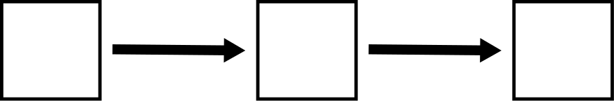

# Mediation {#mediation}

```{r, echo = FALSE, fig.align= "center"}
knitr::include_graphics("graphics/mediation.png")
```


## Preliminaries {-}

We will load the `tidyverse` package to work with tibbles and `lavaan`.

```{r}
library(tidyverse)
library(lavaan)
```


## Mediators, confounders, and colliders {#mediation-paths}

To start off, let's look at all possible paths that connect three variables with two arrows. (For the moment, we'll leave out variances, covariances, and error terms.)

```{r, echo = FALSE, fig.align= "center"}

```

```{r, echo = FALSE, fig.align= "center"}
knitr::include_graphics("graphics/mediator_left.png")
```

```{r, echo = FALSE, fig.align= "center"}
knitr::include_graphics("graphics/confounder.png")
```

```{r, echo = FALSE, fig.align= "center"}
knitr::include_graphics("graphics/collider.png")
```

The second model is just a copy of the first model reversed, so we can disregard it. The other three models are genuinely distinct models with somewhat different consequences for the relationship among the three variables. The first part of this chapter will make these distinctions clear.


## Exogenous and endogenous variables {#mediation-exogenous-endogenous}

In the first model above, the middle variable is called a *mediator*. It's clear that the variable on the left is exogenous and the variable on the right is endogenous. What is the middle variable, exogenous or endogenous?

Here we give a more specific definition of these two terms:

::: {.rmdimportant}

An *exogenous* variable is one that has no unidirectional arrows (so not counting double-headed arrows) entering it in the model diagram. It has only unidirectional arrows leaving it.

An *endogenous* variable is one that has at least one unidirectional arrow entering it (again, not counting double-headed arrows). It may have other unidirectional arrows both entering and/or leaving.

:::

* The prefix *exo-* means "outside". So whatever variability there is in an exogenous variable must come from "outside" the model. There are no unidirectional arrows coming in, so there is nothing in the model to account for its variance, or, for that matter, its covariance with other exogenous variables.

* The prefix *endo-* means "within". The variability of endogenous variables is accounted for by other variables (including error terms) inside the model. The fact that there might be arrows leaving endogenous variables is irrelevant for this definition. It's only about arrows coming in.

::: {.rmdnote}

According to the definition above, is a mediating variable exogenous or endogenous?

:::

Here are the three Really Important Rules (RIR&trade;) for using exogenous and endogenous variables in models:

::: {.rmdimportant}

* Every exogenous variable in a model requires a double-headed arrow pointing to itself, representing its variance.

* Every pair of exogenous variables in a model requires a double-headed arrow joining them, representing their covariance.

* Every endogenous variable in a model requires an error term.

:::

These three rules have important justifications. Don't just memorize the rules blindly. Understand why they are imperative.

* Exogenous variables vary, but the source of their variance is not in the model. (That's what makes them exogenous.) Therefore, we have to represent their variance "manually" in the model by indicating it with a double-headed arrow.

* Pairs of exogenous variables co-vary. The source of that covariance is not in the model, so we have to represent it "manually" by indicating it with a double-headed arrow.

* Endogenous variables vary, but the model is supposed to account for that variance. Some of that accounting happens through arrows coming in, but the model will never be able to explain 100\% of the variance of an endogenous variable just using other variables in the model. There will always be residuals, so these residuals have to be represented "manually" in the model using error terms.


## Mediators {#mediation-mediators}

Let's name our variables. Generally, we'll follow the convention of naming exogenous variables using $X$ and endogenous variables using $Y$. (When we model real-world data, we'll use contextually meaningful names.)

We'll need another convention to label the parameters along the paths of the model:

* Thick arrows between an exogenous variable $X_{i}$ and an endogenous variable $Y_{j}$ will be called $b_{ji}$. Note the order of the subscripts. We always start with the subscript of the target variable and end with the subscript of the predictor.

* Thick arrows between an endogenous variable $Y_{i}$ and another endogenous variable $Y_{j}$ will be called $a_{ji}$.

::: {.rmdnote}

Why do we not need a naming convention for thick arrows between two exogenous variables?

:::

Let's also include all the extra bits of the model required by the aforementioned rules: a variance term for the exogenous variable $X_{1}$ and error terms for the two endogenous variables $Y_{1}$ and $Y_{2}$.

```{r, echo = FALSE, fig.align= "center"}
knitr::include_graphics("graphics/mediator_vars.png")
```

::: {.rmdnote}

Why did we not include any covariances in the model above?

:::


## Confounders {#mediation-confounders}


## Colliders {#mediation-colliders}


## The simple mediation model {#mediation-simple}

