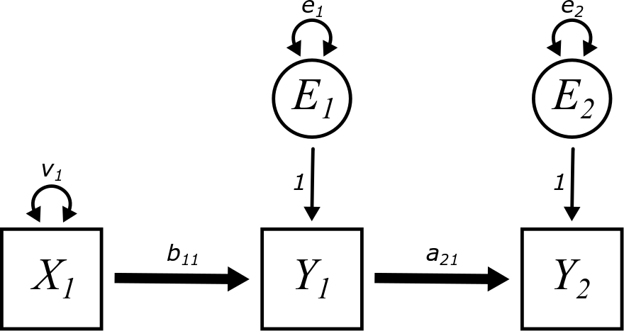

# Mediation {#mediation}

```{r, echo = FALSE, fig.align= "center"}
knitr::include_graphics("graphics/mediation.png")
```


## Preliminaries {-}

We will load the `tidyverse` package to work with tibbles and `lavaan`.

```{r}
library(tidyverse)
library(lavaan)
```


## Arrows going everywhere! {#mediation-arrows}

To start off, let's look at all possible paths that connect three variables with two arrows. (For the moment, we'll leave out variances, covariances, and error terms.)

```{r, echo = FALSE, fig.align= "center"}
knitr::include_graphics("graphics/mediator_right.png")
```

```{r, echo = FALSE, fig.align= "center"}
knitr::include_graphics("graphics/mediator_left.png")
```

```{r, echo = FALSE, fig.align= "center"}
knitr::include_graphics("graphics/confounder.png")
```

```{r, echo = FALSE, fig.align= "center"}
knitr::include_graphics("graphics/collider.png")
```

The second model is just a copy of the first model reversed, so we can disregard it. The other three models are genuinely distinct models with somewhat different consequences for the relationship among the three variables:

* The first model represents a "mediator".
* The third model represents a "confounder".
* The fourth model represents a "collider".

The first part of this chapter will make these distinctions clear.


## Exogenous and endogenous variables {#mediation-exogenous-endogenous}

Look at the first model above. It's clear that the variable on the left is exogenous and the variable on the right is endogenous. The middle variable is called a *mediator*. Is it exogenous or endogenous?

Here we give a more specific definition of these two terms:

::: {.rmdimportant}

An *exogenous* variable is one that has no unidirectional arrows (so not counting double-headed arrows) entering it in the model diagram. It has only unidirectional arrows leaving it.

An *endogenous* variable is one that has at least one unidirectional arrow entering it (again, not counting double-headed arrows). It may have other unidirectional arrows both entering and/or leaving.

:::

* The prefix *exo-* means "outside". So whatever variability there is in an exogenous variable must come from "outside" the model. There are no unidirectional arrows coming in, so there is nothing in the model to account for its variance, or, for that matter, its covariance with other exogenous variables.

* The prefix *endo-* means "within". The variability of endogenous variables is accounted for by other variables (including error terms) inside the model. The fact that there might be arrows leaving endogenous variables is irrelevant for this definition. It's only about arrows coming in.

::: {.rmdnote}

According to the definition above, is a mediator exogenous or endogenous?

:::

Here are the Really Important Rules (RIR&trade;) for working with exogenous and endogenous variables in models. They come in three pairs:

::: {.rmdimportant}

* **Rule 1:**
    * Every exogenous variable in a model requires a double-headed arrow pointing to itself, representing its variance.
    * No endogenous variable should have a double-headed arrow pointing to itself.

* **Rule 2:**
    * Every pair of exogenous variables in a model---except error terms---requires a double-headed arrow joining them, representing their covariance.
    * No other pair of variables in a model (between exogenous and endogenous, or between endogenous) should have a double-headed arrow joining them.
    
* **Rule 3:**
    * Every endogenous variable in a model requires an error term.
    * No exogenous variable in a model should have an error term.

:::

These rules have important justifications. Don't just memorize the rules blindly. Understand why they are imperative.

* **Rule 1:**
    * Exogenous variables vary, but the source of their variance is not in the model. (That's what makes them exogenous.) Therefore, we have to represent their variance "manually" in the model by indicating it with a double-headed arrow.
    * On the other hand, the variance of endogenous variables is accounted for by other variables in the model already, so it doesn't need a separate parameter representing its variance.

* **Rule 2:**
    * Pairs of exogenous variables co-vary. The source of that covariance is not in the model, so we have to represent it "manually" by indicating it with a double-headed arrow. Error terms are the exception to this rule. While it's possible that error terms can co-vary, that usually isn't sensible for most models. A future chapter [LINK] will cover how and when error terms can be correlated, but it should never be the default assumption of the model.
    * Covariances between other types of variables (exogenous to endogenous, or endogenous to endogenous) are consequences of the other arrows in the diagram that create direct and indirect paths among the variables, so their covariance is not separately drawn as a double-headed arrow.

* **Rule 3:**
    * While the model is supposed to account for the variance of endogenous variables through incoming arrows, it will never be able to explain 100\% of that variance just using other variables in the model. There will always be residuals, so these residuals have to be represented "manually" in the model using error terms.
    * Exogenous variables are assumed to be measured without error. While that assumption is not always very realistic in the real world, we don't have much of a choice. By their very definition, the variance of exogenous variable isn't accounted for by anything else in the model, so error terms just don't make any sense for them.

::: {.rmdnote}

Here's the first model of the four shown earlier:

```{r, echo = FALSE, fig.align= "center"}
knitr::include_graphics("graphics/mediator_right.png")
```

Draw this model on your own piece of paper. Following the rules above, draw in all variances, covariances, or error terms that should be present in the diagram. (Don't worry about labeling anything with letters yet. Just draw the arrows and the circles.)

:::


## Naming conventions {#mediation-naming}

We need to establish some conventions for naming things.

* We need to name our variables. When we model real-world data, we'll use contextually meaningful names, but for abstract models we draw, we need a consistent way of labeling them.
    * Exogenous variables will be called $X_{i}$ (using numbers as subscripts).
    * Endogenous variables will be called $Y_{i}$ (also using numbers as subscripts).
    * Error terms will be called $E_{i}$ with subscripts matching the ones on the endogenous variables $Y_{i}$ to which they're attached.

* We need to label the parameters along the various paths of the model:
    * Variances will be called $v_{i}$ with subscripts matching the exogenous variables $X_{i}$ to which they're attached.
    * Error variances will be called $e_{i}$ with subscripts matching the error terms $E_{i}$ to which they're attached.
    * Covariances will be called $c_{ij}$ connecting exogenous variables $X_{i}$ and $X_{j}$. (Since covariance is symmetric, it could also be called $c_{ji}$.)
    * Unidirectional arrows from error terms to their corresponding endogenous variables will always be fixed parameters labeled with "1".
    * Thick, unidirectional arrows between an exogenous variable $X_{i}$ and an endogenous variable $Y_{j}$ will be called $b_{ji}$. Note the order of the subscripts: we always start with the subscript of the target variable and end with the subscript of the predictor.
    * Thick, unidirectional arrows between an endogenous variable $Y_{i}$ and another endogenous variable $Y_{j}$ will be called $a_{ji}$.

::: {.rmdnote}

Why do we not need a naming convention for thick arrows between two exogenous variables?

:::


## Mediators {#mediation-mediators}

With all the rules in place for our diagrams, we can now revisit the model from above, but now, let's include all the extra bits of the model required by the aforementioned rules: a variance term for the exogenous variable $X_{1}$, error terms for the two endogenous variables $Y_{1}$ and $Y_{2}$, and parameter labels for everything.

```{r, echo = FALSE, fig.align= "center"}

```

::: {.rmdnote}

Why did we not include any covariances in the model above?

:::

Since there are two endogenous variables present in this model, there are two regression equations we have to write down:

\begin{align}
Y_{1} &= b_{11}X_{1} + E_{1}        \\
Y_{2} &= a_{21}Y_{1} + E_{2}
\end{align}

The sample covariance matrix will look like

$$
\begin{bmatrix}
Var(X_{1})          &   \bullet             &   \bullet \\
Cov(Y_{1}, X_{1})   &   Var(Y_{1})          &   \bullet \\
Cov(Y_{2}, X_{1})   &   Cov(Y_{2}, Y_{1})   &   Var(Y_{2})
\end{bmatrix}
$$

::: {.rmdnote}

When working through covariance calculations in the past chapters, we've seen lots of terms pop out of the form $Cov(E, X)$. We've gotten used to canceling these terms because they are zero. (Why must they be zero?)

In this model, some of the covariance calculations will result in terms of the form $Cov(E, Y)$. These will not necessarily cancel, so we need to be more cautious.

Calculate $Cov(E_{1}, Y_{1})$ for the model above by substituting the regression equation $Y_{1} = b_{11}X_{1} + E_{1}$. You should get $e_{1}$ (and *not* zero).

Without doing any calculations, why would we also expect $Cov(E_{1}, Y_{2})$ to be non-zero? (Hint: how are $E_{1}$ and $Y_{2}$ connected in the diagram?)

On the other hand, why would we expect $Cov(E_{1}, E_{2})$ to be zero in general? (Hint: look back to Really Important Rule 2 above.)

Finally, we *will* expect $Cov(E_{2}, Y_{1})$ to be zero. Why? If you're stuck, go ahead and do the calculation to confirm.

:::

::: {.rmdnote}

Calculate the full model-implied matrix. You should get the following:

$$
\begin{bmatrix}
v_{1}   &   \bullet &  \bullet  \\
b_{11}v_{1}  &   b_{11}^{2}v_{1} + e_{1}   &  \bullet \\
a_{21}b_{11}v_{1}  &  a_{21}b_{11}^{2}v_{1} + a_{21}e_{1}  &   a_{21}^{2}b_{11}^{2}v_{1} + a_{21}^2e_{1} + e_{2}
\end{bmatrix}
$$

If this is too tedious and time-consuming, just pick one or two of these entries to compute.

:::

If we standardize our variables, the sample covariance matrix (which is now a correlation matrix) is

$$
\begin{bmatrix}
1                   &   \bullet             &   \bullet \\
Corr(Y_{1}, X_{1})  &   1                   &   \bullet \\
Corr(Y_{2}, X_{1})  &   Corr(Y_{2}, Y_{1})   &   1
\end{bmatrix}
$$
We've switched to using $Corr$ instead of using the letter $r$ for this exercise. That's because $r_{Y_{1}X_{1}}$, $r_{Y_{2}X_{1}}$, and $r_{Y_{2}Y_{1}}$ have subscripts inside of subscripts and are hard to read and process.

::: {.rmdnote}

Setting the correlation matrix equal to the model-implied matrix above, we get
$$
v_{1} = 1
$$
pretty much for free.

Now solve for $b_{11}$ and $e_{1}$ next using the two terms in the second row of the matrix. You should get:

\begin{align}
b_{11}  &= Corr(Y_{1}, X_{1})       \\
e_{1}   &= 1 - Corr(Y_{1}, X_{1})^{2}
\end{align}

Why is this not surprising? (Hint: if you ignore $Y_{2}$ altogether and only pay attention to relationships between $X_{1}$, $Y_{1}$, and $E_{1}$, what kind of model is this?)

:::

The parameter $a_{21}$ is interesting. The equation implied by the lower-left element of the matrix---corresponding to $Corr(Y_{2}, X_{1})$---is

\begin{align}
Corr(Y_{2}, X_{1})  &= a_{21}b_{11}v_{1}        \\
                    &= a_{21}Corr(Y_{1}, X_{1})
\end{align}

Solving for $a_{21}$:

$$
a_{21} = \frac{Corr(Y_{2}, X_{1})}{Corr(Y_{1}, X_{1})}
$$

On the other hand, the equation implied by the center element on the bottom row of the matrix---corresponding to $Corr(Y_{2}, Y_{1})$---is

\begin{align}
Corr(Y_{2}, Y_{1})
    &= a_{21}b_{11}^{2}v_{1} + a_{21}e_{1}  \\
    &= a_{21}Corr(Y_{1}, X_{1})^{2} + 
        a_{21}\left( 1 - Corr(Y_{1}, X_{1})^{2} \right) \\
    &= a_{21}Corr(Y_{1}, X_{1})^{2} +
        a_{21} - a_{21}Corr(Y_{1}, X_{1})^{2}       \\
    &= a_{21}
\end{align}

So we get two different answers for $a_{21}$!

::: {.rmdnote}

Use $a_{21} = Corr(Y_{2}, Y_{1})$ along with everything else you've learned to solve for $e_{2}$ using the equation in the lower-right corner of the matrix. (This is the only one we can use because it's the only term involving $e_{2}$!)

It may look ugly, but you might be surprised at the simplicity of the answer that pops out. You should get
$$
e_{2} = 1 - Corr(Y_{2}, Y_{1})^{2}
$$

Again, though, why is that not really all that surprising? (Hint: what if you ignore $X_{1}$ and treat the relationship between $Y_{1}$, $Y_{2}$, and $E_{2}$ as a simple regression?)

:::

Since we got two different answers for $a_{21}$, if this model is correct, they must be equal:

$$
a_{21} = Corr(Y_{2}, Y_{1}) = \frac{Corr(Y_{2}, X_{1})}{Corr(Y_{1}, X_{1})}
$$

which, if we rearrange the fraction, implies

$$
Corr(Y_{1}, X_{1}) Corr(Y_{2}, Y_{1}) = Corr(Y_{2}, X_{1}) 
$$

Another way to state this is that the correlation along the first path ($b_{11}$) and the correlation along the second path ($a_{21}$) multiply to give the correlation along both paths combined.

But these three correlations are numbers that are measured using the data. Is there any guarantee that the product of two of the correlations will necessarily equal the third?

**No!**

In fact, this will almost never be true with real data.

::: {.rmdnote}

So if the model *implies* that there must be a mathematical relationship among the correlations, but the data does not support that implication, what does that say about the model?

:::

We'll return to this example in a moment. But first, let's explore some of the other model configurations set up at the beginning of the chapter.


## Confounders {#mediation-confounders}

The variable in the middle of the diagram below is called a "confounder": 

```{r, echo = FALSE, fig.align= "center"}
knitr::include_graphics("graphics/confounder.png")
```

::: {.rmdnote}

Draw this model on your own piece of paper.

Identify if the variables are exogenous or endogenous.

Following the Really Important Rules, draw in all variances, covariances, or error terms that should be present in the diagram.

Finally, see if you can label all path with letters and subscripts according to the naming conventions described earlier.

:::

Here is the final model:

```{r, echo = FALSE, fig.align= "center"}

```

The sample covariance matrix will look exactly the same as it did for the mediation model above.

$$
\begin{bmatrix}
Var(X_{1})          &   \bullet             &   \bullet \\
Cov(Y_{1}, X_{1})   &   Var(Y_{1})          &   \bullet \\
Cov(Y_{2}, X_{1})   &   Cov(Y_{2}, Y_{1})   &   Var(Y_{2})
\end{bmatrix}
$$
This is because there are still three observed variables and they have the same three names, even if they are connected with arrows in a different way.

This also means the sample correlation matrix is the same:

$$
\begin{bmatrix}
1                   &   \bullet             &   \bullet \\
Corr(Y_{1}, X_{1})  &   1                   &   \bullet \\
Corr(Y_{2}, X_{1})  &   Corr(Y_{2}, Y_{1})   &   1
\end{bmatrix}
$$

::: {.rmdnote}

Calculate the full model-implied matrix. You should get the following:

$$
\begin{bmatrix}
v_{1}   &   \bullet &  \bullet  \\
b_{11}v_{1}  &   b_{11}^{2}v_{1} + e_{1}    &  \bullet \\
b_{21}v_{1}  &   b_{11}b_{21}v_{1}          &  b_{21}^{2}v_{1} + e_{2}
\end{bmatrix}
$$

Don't slack off on this one! Unlike the mediation example, all these terms are very straightforward to compute.

:::

::: {.rmdnote}

Now calculate the standardized solution. In other words, solve for all the free parameters using the sample correlation matrix.

You should get the following:

\begin{align}
v_{1}   &= 1                        \\
b_{11}  &= Corr(Y_{1}, X_{1})         \\
e_{1}   &= 1 - Corr(Y_{1}, X_{1})^{2} \\
e_{2}   &= 1 - Corr(Y_{2}, X_{1})^{2}
\end{align}

Check that two of the equations give two different solutions for $b_{21}$:

\begin{align}
b_{21}  &= Corr(Y_{2}, X_{1})                             \\
b_{21}  &= \frac{Corr(Y_{2}, Y_{1})}{Corr(Y_{1}, X_{1})}
\end{align}

:::

The last calculation implies that

$$
Corr(Y_{1}, X_{1}) Corr(Y_{2}, X_{1}) = Corr(Y_{2}, Y_{1}) 
$$

Another way to state this is that the correlation along the first path ($b_{11}$) and the correlation along the second path ($b_{21}$) multiply to give the correlation along both paths combined.

But these three correlations are numbers that are measured using the data. Is there any guarantee that the product of two of the correlations will necessarily equal the third?

**No!**

In fact, this will almost never be true with real data.

::: {.rmdnote}

So if the model *implies* that there must be a mathematical relationship among the correlations, but the data does not support that implication, what does that say about the model?

:::

Does this all sound familiar? It's even more déjà vu than you think. Here are the standardized parameter solutions from the mediator example:

\begin{align}
v_{1}   &= 1                            \\
e_{1}   &= 1 - Corr(Y_{1}, X_{1})^{2}   \\
e_{2}   &= 1 - Corr(Y_{2}, Y_{1})^{2}      \\
b_{11}  &= Corr(Y_{1}, X_{1})           \\
a_{21}  &= Corr(Y_{2}, Y_{1}) = \frac{Corr(Y_{2}, X_{1})}{Corr(Y_{1}, X_{1})}
\end{align}

And here are the standardized parameter solutions from the confounder example:

\begin{align}
v_{1}   &= 1                            \\
e_{1}   &= 1 - Corr(Y_{1}, X_{1})^{2}   \\
e_{2}   &= 1 - Corr(Y_{2}, X_{1})^{2}   \\
b_{11}  &= Corr(Y_{1}, X_{1})           \\
b_{21}  &= Corr(Y_{2}, X_{1}) = \frac{Corr(Y_{2}, Y_{1})}{Corr(Y_{1}, X_{1})}
\end{align}

Other than just a change of notation---owing to the fact that the roles of $X_{1}$ and $Y_{1}$ are reverse in the collider example---the solutions are *identical*.


## Colliders {#mediation-colliders}


## The simple mediation model {#mediation-simple}


## Simple mediation in R {#mediation-r}

